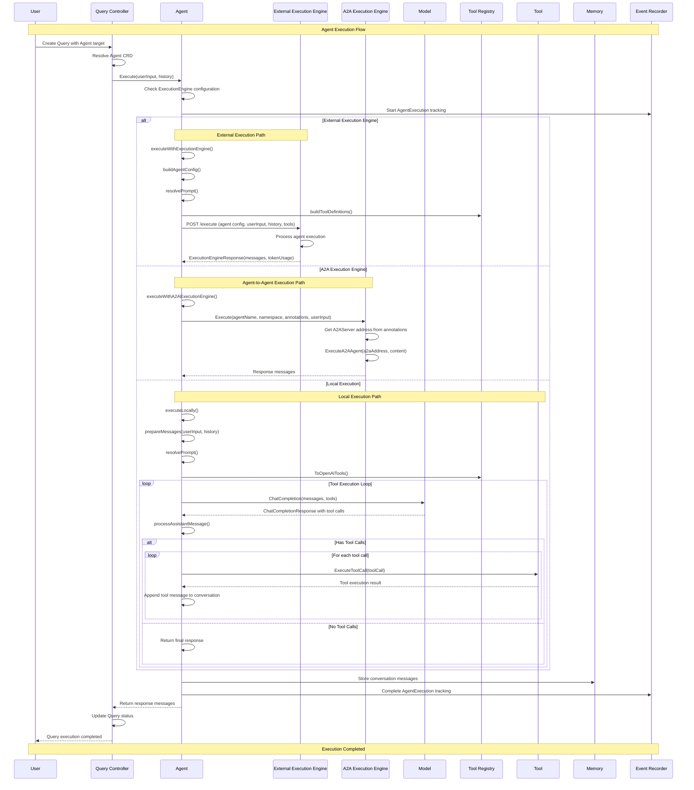

# Agent Execution Flow - Sequence Diagram

Code Version: v0.1.31  
Last updated on September 4, 2025

This document explains the sequence diagram for **Agent Execution Flow** in ARK, showing how agents are executed when processing user queries. The system supports three different execution modes: local execution, external execution engines, and Agent-to-Agent (A2A) execution.

## System Overview

### Key Participants

1. **User** - Initiates the agent execution request
2. **QueryController** - Orchestrates the overall query execution
3. **Agent** - The AI agent being executed  
4. **ExecutionEngine (External)** - Optional external execution service
5. **A2AExecutionEngine** - Agent-to-Agent execution engine
6. **Model** - Language model (OpenAI, etc.)
7. **ToolRegistry** - Registry of available tools
8. **Tool** - Individual tools that agents can invoke
9. **Memory** - Conversation memory service
10. **EventRecorder** - Records execution events and metrics

### Execution Modes

The agent execution flow supports three distinct execution modes:

1. **Local Execution**: Uses ARK's built-in OpenAI-compatible engine
2. **External Execution Engine**: Delegates to external execution services
3. **A2A Execution**: Uses Agent-to-Agent communication protocol

## Sequence Diagram



## Execution Flow Phases

### Phase 1: Execution Initiation
- **User creates Query**: A Query resource is created targeting a specific Agent
- **Controller resolution**: QueryController resolves the Agent CRD from Kubernetes
- **Agent execution trigger**: The Agent.Execute() method is called with user input and conversation history

### Phase 2: Execution Mode Decision
The agent determines its execution mode based on configuration:

#### External Execution Engine Path
- **Configuration building**: Agent builds configuration including prompt, parameters, and model settings
- **Tool preparation**: Available tools are converted to execution engine format
- **External call**: HTTP POST request sent to external execution engine
- **Response processing**: External engine returns processed messages and token usage

#### A2A Execution Path  
- **A2A resolution**: Agent resolves A2A server address from annotations
- **A2A communication**: Communicates with remote agent via A2A protocol
- **Response conversion**: A2A response converted to standard message format

#### Local Execution Path
- **Message preparation**: System prompt, conversation history, and user input are prepared
- **Tool registration**: Available tools are registered with the model
- **Iterative execution**: Model is called iteratively to handle tool calls
- **Tool execution**: When model requests tool calls, each tool is executed sequentially
- **Response compilation**: Final response is compiled from all interaction rounds

### Phase 3: Memory and Event Recording
- **Memory storage**: Conversation messages are stored in the Memory service for future context
- **Event recording**: Execution metrics and events are recorded for observability
- **Response return**: Final response messages are returned to the QueryController

### Phase 4: Response Handling
- **Status update**: QueryController updates the Query resource status with results
- **Completion notification**: User receives notification that query execution is completed

## Key Implementation Details

### Agent Configuration
```go
type AgentConfig struct {
    Name         string
    Namespace    string  
    Prompt       string
    Description  string
    Parameters   []Parameter
    Model        ExecutionEngineModel
    OutputSchema *runtime.RawExtension
}
```

### Execution Engine Interface
External execution engines must implement:
- `POST /execute` endpoint
- Accept `ExecutionEngineRequest` format
- Return `ExecutionEngineResponse` with messages and token usage

### Tool Execution Loop
Local execution uses an iterative approach:
1. Send messages to model with available tools
2. Process model response and any tool calls
3. Execute each requested tool call
4. Append tool results to conversation
5. Repeat until no more tool calls are needed

### Error Handling
- **Execution tracking**: All execution paths use OperationTracker for monitoring
- **Failure recording**: Errors are recorded with EventRecorder for observability
- **Timeout management**: External calls include configurable timeout handling
- **Context cancellation**: Supports context-based cancellation for long-running operations

## Performance Considerations

- **Timeout configuration**: External execution engines have 5-minute default timeout
- **Tool execution**: Tools are executed sequentially within the conversation loop
- **Memory efficiency**: Message history is managed to prevent excessive memory usage
- **Event emission**: Real-time event emission for monitoring and debugging

