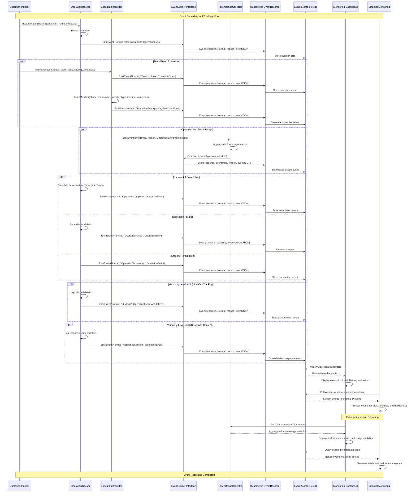

# Event Recording and Tracking - Sequence Diagram

This document explains the sequence diagram for **Event Recording and Tracking** in ARK, showing how events are generated, recorded, and tracked throughout the system lifecycle. ARK provides comprehensive observability through a structured event recording system with configurable verbosity levels.

## System Overview

### Key Participants

1. **Operation Initiator** - Component that starts an operation (User, Controller, Agent, etc.)
2. **OperationTracker** - Tracks individual operations with timing and lifecycle management
3. **ExecutionRecorder** - Records high-level execution events for teams and agents
4. **EventEmitter Interface** - Common interface for event emission across components
5. **TokenUsageCollector** - Collects and aggregates token usage metrics from operations
6. **Kubernetes EventRecorder** - Native Kubernetes event recorder for storing events
7. **Event Storage (etcd)** - Kubernetes cluster storage for event persistence
8. **Monitoring Dashboard** - UI for viewing and filtering events
9. **External Monitoring** - External systems consuming events for observability

### Event Types and Verbosity Levels

ARK implements a 4-level verbosity system for event recording:

#### Level 0 (Always Visible) - Critical Operations
- Query Resolution (start, completion, errors)
- Model Resolution (validation, configuration)

#### Level 1 (Standard) - Operational Events  
- Agent Execution (lifecycle, configuration)
- Team Execution (strategy execution)
- Tool Calls (invocation, results)
- Team Members (individual execution)

#### Level 2 (Detailed) - LLM Call Tracking
- LLM Calls (requests, responses, token usage)
- Execution Engine Calls (external service communication)
- A2A Calls (agent-to-agent communication)

#### Level 3 (Debug) - Response Content
- LLM Response Content (full response text)
- Tool Response Content (detailed tool outputs)
- Debug Information (internal state, detailed metadata)

### Event Categories

1. **OperationEvent** - Individual operation tracking with timing and token usage
2. **ExecutionEvent** - High-level execution events for teams and agents
3. **BaseEvent** - Common event structure with name and metadata

## Sequence Diagram



## Event Recording Flow Phases

### Phase 1: Operation Initiation and Start Event
- **Tracker creation**: `NewOperationTracker` creates a new tracker for the operation
- **Start time recording**: Current timestamp is recorded for duration calculation
- **Start event emission**: `OperationStart` event is emitted with initial metadata
- **Event storage**: Event is stored in Kubernetes etcd through the EventRecorder

### Phase 2: High-Level Execution Recording
- **Team execution events**: Team strategy execution events are recorded
- **Team member events**: Individual team member execution within teams
- **Agent execution events**: Agent lifecycle and model interaction events
- **Execution context**: Events include phase information (Start, Complete, etc.)

### Phase 3: Token Usage Collection
- **Token aggregation**: `TokenUsageCollector` aggregates token usage from operations
- **Usage metrics**: Prompt tokens, completion tokens, and total tokens are tracked
- **Performance monitoring**: Token usage enables cost and performance analysis
- **Event correlation**: Token events are correlated with their parent operations

### Phase 4: Operation Completion
- **Duration calculation**: Time difference from start to completion is calculated
- **Success completion**: Normal completion events include duration and results
- **Error handling**: Failed operations emit Warning events with error details
- **Graceful termination**: Special termination events for cancelled operations

### Phase 5: Verbosity-Based Detailed Logging
- **Level 2 tracking**: LLM call details including request/response metadata
- **Level 3 debugging**: Full response content for detailed debugging
- **Conditional emission**: Events are only emitted if verbosity level is sufficient
- **Performance consideration**: Higher verbosity levels have performance impact

### Phase 6: Event Consumption and Monitoring
- **Dashboard consumption**: Web UI consumes events for real-time monitoring
- **Event filtering**: Events can be filtered by type, resource, time range, etc.
- **External monitoring**: External systems consume events for alerting and metrics
- **Real-time streaming**: Events can be streamed in real-time for monitoring

### Phase 7: Event Aggregation and Analysis
- **Token summary**: Aggregated token usage statistics for cost analysis
- **Performance metrics**: Duration and success rate analysis
- **Alert generation**: External systems generate alerts based on event patterns
- **Trend analysis**: Historical event data enables trend and performance analysis

## Event Structure and Metadata

### OperationEvent Structure
```json
{
  "name": "operation-name",
  "metadata": {
    "component": "query|agent|team|tool|llm|model",
    "namespace": "kubernetes-namespace",
    "queryId": "unique-query-identifier",
    "sessionId": "conversation-session-id"
  },
  "error": "error message if failed",
  "duration": "2.5s",
  "token_usage": {
    "prompt_tokens": 150,
    "completion_tokens": 75,
    "total_tokens": 225
  }
}
```

### ExecutionEvent Structure
```json
{
  "name": "resource-name",
  "metadata": {
    "team": "team-name",
    "strategy": "sequential|parallel|round-robin",
    "model": "gpt-4",
    "turn": "1"
  },
  "type": "team|agent|tool"
}
```

## Configuration and Verbosity Control

### Environment Variables
- `ZAPLOGLEVEL`: Controls event verbosity level (0-3)
- Higher levels include all events from lower levels

### Development Configuration
```bash
# Level 0 (default) - critical operations only
make dev

# Level 1 - add operational events  
make dev ARGS="--zap-log-level=1"

# Level 2 - add LLM call tracking
make dev ARGS="--zap-log-level=2"

# Level 3 - add response content (debug)
make dev ARGS="--zap-log-level=3"
```

### Production Deployment
```yaml
apiVersion: apps/v1
kind: Deployment
metadata:
  name: ark-controller
spec:
  template:
    spec:
      containers:
      - name: manager
        env:
        - name: ZAPLOGLEVEL
          value: "1"  # Recommended for production
        args:
        - --zap-log-level=$(ZAPLOGLEVEL)
```

## Event Filtering and Analysis

### Common Event Queries
```bash
# All events for a specific query
kubectl get events --field-selector involvedObject.name=my-query

# Warning events only
kubectl get events --field-selector type=Warning

# Events from specific component
kubectl get events --field-selector reason=QueryExecutionComplete

# Recent events (last hour)
kubectl get events --field-selector firstTimestamp>=$(date -u -d '1 hour ago' +%Y-%m-%dT%H:%M:%SZ)
```

### Event Types by Category
- **Normal Events**: Successful operations, informational events
- **Warning Events**: Errors, failures, configuration issues
- **Reason Codes**: Structured reason identifiers (e.g., "QueryComplete", "AgentExecutionFailed")

## Performance Considerations

### Verbosity Level Impact
- **Level 0-1**: Minimal performance impact, suitable for production
- **Level 2**: Moderate impact, adds LLM call tracking overhead
- **Level 3**: High impact, includes response content serialization

### Event Storage
- **Retention**: Kubernetes events have default TTL (typically 1 hour)
- **External storage**: Consider external event aggregation for long-term storage
- **Volume**: Higher verbosity levels generate significantly more events

This comprehensive event recording and tracking system provides full observability into ARK operations while maintaining configurable performance characteristics through verbosity levels.
