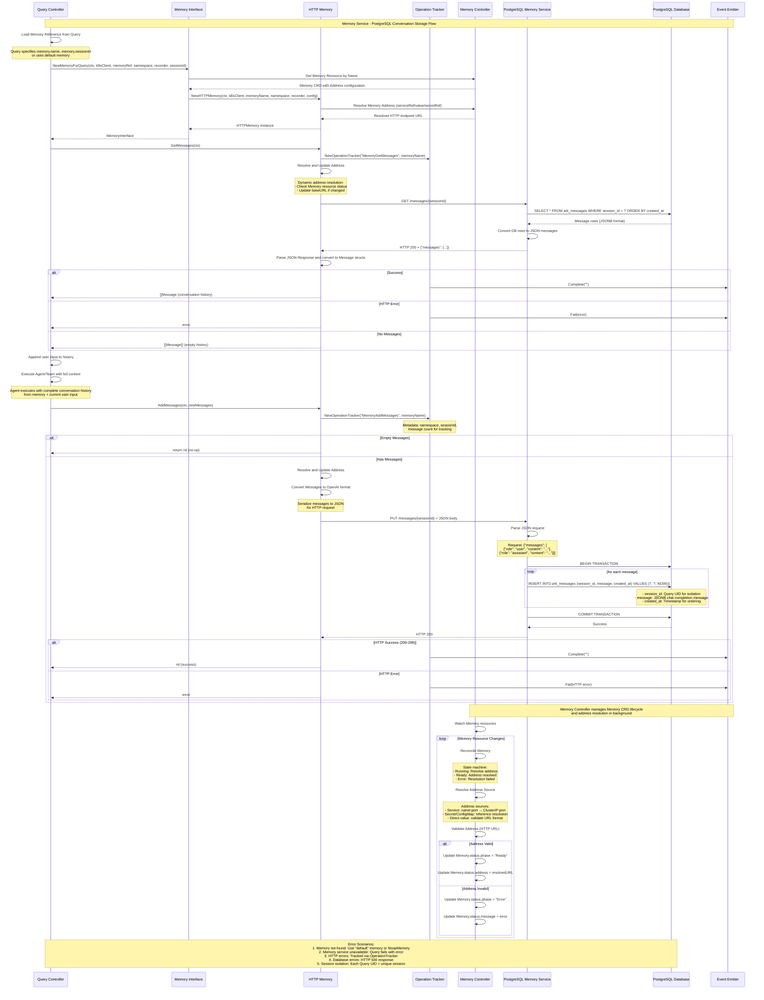

# Memory Service (PostgreSQL) - Sequence Diagram

Code Version: v0.1.31  
Last updated on September 4, 2025

This document explains the sequence diagram for **Memory Service (PostgreSQL)** integration in ARK, showing how conversation history is stored and retrieved using PostgreSQL with session-based isolation and persistent storage capabilities.

## System Overview

### Key Participants

1. **Query Controller** - Core ARK controller managing query lifecycle and memory integration
2. **Memory Interface** - ARK memory abstraction layer for different memory implementations
3. **HTTP Memory** - HTTP-based memory client for communicating with PostgreSQL service
4. **Operation Tracker** - Tracking and observability for memory operations
5. **Memory Controller** - Kubernetes controller managing Memory CRD lifecycle
6. **PostgreSQL Memory Service** - HTTP API service providing memory operations
7. **PostgreSQL Database** - Persistent storage backend for conversation data
8. **Event Emitter** - ARK event system for operation tracking and observability

### Memory Service Architecture

ARK's PostgreSQL Memory Service provides:

#### Core Features
- **Persistent Conversation Storage**: Long-term storage of conversation history across sessions
- **Session-based Isolation**: Each query gets isolated conversation context using unique session IDs
- **HTTP API Interface**: RESTful API for memory operations (GET/PUT messages)
- **Dynamic Address Resolution**: Flexible service discovery and endpoint configuration
- **Transaction Safety**: Database transactions ensure data consistency
- **Event Tracking**: Comprehensive operation logging for observability

#### Memory Types
1. **HTTP Memory**: Production implementation with PostgreSQL backend
2. **Noop Memory**: Development/testing implementation with no persistence

#### Database Schema
- **ark_messages table**: Stores conversation messages with session isolation
- **Session ID**: Query UID ensures conversation separation
- **JSONB format**: OpenAI-compatible message format storage
- **Timestamp ordering**: Messages ordered by creation time

## Sequence Diagram




## Memory Service Flow Phases

### Phase 1: Memory Initialization for Query
- **Memory Reference Loading**: Query Controller extracts memory configuration from Query CRD
- **Memory Discovery**: Memory Interface resolves Memory resource by name in Kubernetes
- **HTTP Memory Creation**: HTTPMemory client is instantiated with resolved configuration
- **Address Resolution**: Memory Controller resolves service endpoints, secrets, or direct URLs
- **Interface Preparation**: Memory interface is ready for conversation operations

### Phase 2: Get Conversation History
- **Operation Tracking**: New operation tracker created for observability and metrics
- **Address Validation**: Dynamic address resolution ensures current endpoint availability
- **HTTP Request**: GET request sent to PostgreSQL Memory Service with session ID
- **Database Query**: PostgreSQL query retrieves messages ordered by creation timestamp
- **Response Processing**: Database rows converted to OpenAI-compatible message format
- **History Delivery**: Complete conversation history returned to Query Controller

### Phase 3: Agent/Team Execution with Context
- **Context Assembly**: User input appended to retrieved conversation history
- **Agent Execution**: Agent or team processes query with complete conversation context
- **Response Generation**: Agent generates response based on full conversation history
- **Context Preservation**: New messages prepared for storage back to memory
- **Conversation Continuity**: Maintains coherent conversation flow across interactions

### Phase 4: Save New Messages to Memory
- **Message Validation**: Check for non-empty message arrays to avoid unnecessary operations
- **Format Conversion**: Messages converted to OpenAI ChatCompletion format for storage
- **HTTP Storage Request**: PUT request sent with new messages to PostgreSQL service
- **Transaction Begin**: Database transaction started to ensure data consistency
- **Batch Insert**: All new messages inserted in single transaction with session isolation
- **Transaction Commit**: Changes committed to database with timestamp ordering

### Phase 5: Memory Controller Lifecycle (Background)
- **Resource Watching**: Continuous monitoring of Memory CRD changes in Kubernetes
- **Address Reconciliation**: Dynamic resolution of service addresses, secrets, and configurations
- **State Management**: Memory resource status updated based on address resolution success
- **Health Monitoring**: Continuous validation of memory service endpoint availability
- **Error Recovery**: Automatic retry and error reporting for failed address resolutions

### Phase 6: Error Handling and Session Management
- **Fallback Strategy**: Graceful degradation to default memory or noop implementation
- **Session Isolation**: Each Query UID creates isolated conversation context
- **Error Propagation**: Comprehensive error tracking through operation tracker system
- **Database Recovery**: Transaction rollback and retry logic for database failures
- **Observability**: Complete operation logging for debugging and monitoring

## Service Configuration and Deployment

### Memory CRD Configuration
```yaml
apiVersion: ark.mckinsey.com/v1alpha1
kind: Memory
metadata:
  name: postgres-memory
spec:
  address:
    serviceRef:
      name: postgres-memory-service
      port: 8080
  description: "PostgreSQL-backed persistent memory storage"
```

### Agent Configuration with Memory
```yaml
apiVersion: ark.mckinsey.com/v1alpha1
kind: Agent
metadata:
  name: conversation-agent
spec:
  memory:
    name: postgres-memory
    sessionId: "user-session-123"  # Optional: custom session ID
  model:
    name: gpt-4
    type: openai
  prompt: |
    You are a helpful assistant with conversation memory.
    Use the conversation history to provide contextual responses.
```

### Service Deployment
```bash
# Install PostgreSQL Operator and Memory Service
make postgres-memory-install

# Development mode
make postgres-memory-dev

# Database access
make postgres-connect
```

## Database Schema and Operations

### ARK Messages Table
```sql
CREATE TABLE ark_messages (
    id SERIAL PRIMARY KEY,
    session_id VARCHAR(255) NOT NULL,
    message JSONB NOT NULL,
    created_at TIMESTAMP DEFAULT NOW()
);

CREATE INDEX idx_session_created ON ark_messages(session_id, created_at);
```

### Message Storage Format
```json
{
  "role": "user|assistant|system",
  "content": "Message content",
  "name": "agent-name",
  "function_call": {
    "name": "function_name",
    "arguments": "{\"param\": \"value\"}"
  }
}
```

### Session Management
- **Session ID**: Query.metadata.uid ensures unique conversation contexts
- **Isolation**: Each query gets separate conversation history
- **Persistence**: Conversations survive pod restarts and scaling
- **Ordering**: Messages retrieved in chronological order

## HTTP API Endpoints

### Get Messages
```http
GET /messages/{sessionId}
Response: {
  "messages": [
    {"role": "user", "content": "Hello"},
    {"role": "assistant", "content": "Hi there!"}
  ]
}
```

### Add Messages
```http
PUT /messages/{sessionId}
Content-Type: application/json

{
  "messages": [
    {"role": "user", "content": "New message"},
    {"role": "assistant", "content": "Response"}
  ]
}
```

## Memory Types and Implementations

### HTTP Memory (Production)
- **Backend**: PostgreSQL database with HTTP API
- **Features**: Persistent storage, session isolation, transaction safety
- **Use Case**: Production deployments requiring conversation history
- **Configuration**: Service reference or direct URL

### Noop Memory (Development)
- **Backend**: In-memory (no persistence)
- **Features**: Always returns empty history, discards new messages
- **Use Case**: Development, testing, stateless scenarios
- **Configuration**: No external dependencies

## Error Handling and Recovery

### Connection Errors
- **Service Discovery**: Automatic retry of address resolution
- **HTTP Timeouts**: Configurable timeout and retry policies
- **Database Connectivity**: PostgreSQL connection pooling and recovery
- **Fallback**: Graceful degradation to noop memory if configured

### Data Consistency
- **Transaction Safety**: All message operations wrapped in database transactions
- **Rollback**: Automatic rollback on partial failures
- **Concurrency**: Session-based isolation prevents data conflicts
- **Backup**: PostgreSQL backup and recovery procedures

### Observability and Monitoring
- **Operation Tracking**: All memory operations tracked with metrics
- **Event Emission**: Success and failure events for monitoring
- **Health Checks**: Service health endpoints for availability monitoring
- **Logging**: Comprehensive logging for debugging and analysis

## Performance Considerations

### Database Optimization
- **Indexing**: Optimized indexes on session_id and created_at columns
- **Connection Pooling**: Efficient database connection management
- **Query Optimization**: Efficient conversation history retrieval
- **Partitioning**: Table partitioning for large-scale deployments

### Scalability
- **Horizontal Scaling**: Multiple PostgreSQL Memory Service instances
- **Database Scaling**: PostgreSQL clustering and read replicas
- **Session Distribution**: Load balancing across service instances
- **Caching**: Optional Redis caching layer for frequently accessed conversations

This comprehensive memory service integration provides ARK with robust conversation persistence while maintaining session isolation and data consistency across all agent interactions.

---

---

<div style={{
  marginTop: "3rem",
  padding: "1.5rem",
  backgroundColor: "#f8f9fa",
  border: "1px solid #e9ecef",
  borderLeft: "4px solid #2E86AB",
  borderRadius: "0 6px 6px 0",
  fontSize: "0.875rem",
  color: "#6c757d"
}}>
  <table style={{
    width: "100%",
    borderCollapse: "collapse",
    margin: 0
  }}>
    <tr>
      <td style={{
        padding: 0,
        border: "none",
        verticalAlign: "middle"
      }}>
        <div style={{
          display: "flex",
          alignItems: "center",
          gap: "0.5rem"
        }}>
          <span style={{ fontSize: "1.2em" }}>�</span>
          <span style={{
            fontWeight: 600,
            color: "#2E86AB"
          }}>Memory Service PostgreSQL Integration Sequence Diagram</span>
        </div>
      </td>
      <td style={{
        padding: 0,
        border: "none",
        textAlign: "right",
        verticalAlign: "middle"
      }}>
        <div style={{
          fontFamily: "'SF Mono', 'Monaco', 'Inconsolata', 'Roboto Mono', monospace",
          fontSize: "0.85em"
        }}>
          <strong style={{ color: "#495057" }}>Version:</strong>{" "}
          <code style={{
            background: "#e9ecef",
            padding: "2px 6px",
            borderRadius: "3px",
            color: "#2E86AB",
            fontWeight: "bold"
          }}>v0.1.31</code><br/>
          <strong style={{ color: "#495057" }}>Updated:</strong>{" "}
          <code style={{
            background: "#e9ecef",
            padding: "2px 6px",
            borderRadius: "3px",
            color: "#6c757d"
          }}>2025-09-04</code>
        </div>
      </td>
    </tr>
  </table>
  <div style={{
    marginTop: "1.5rem",
    paddingTop: "1rem",
    borderTop: "1px solid #dee2e6",
    fontSize: "0.75rem",
    color: "#adb5bd",
    textAlign: "center",
    fontWeight: 300,
    letterSpacing: "0.025em"
  }}>
    <span style={{ 
      color: "#6c757d",
      fontWeight: 400 
    }}>Generated from PlantUML source</span>
    <span style={{ 
      margin: "0 0.5rem",
      color: "#dee2e6" 
    }}>•</span>
    <span style={{ 
      color: "#6c757d",
      fontWeight: 400 
    }}>ARK Platform Documentation</span>
  </div>
</div>
