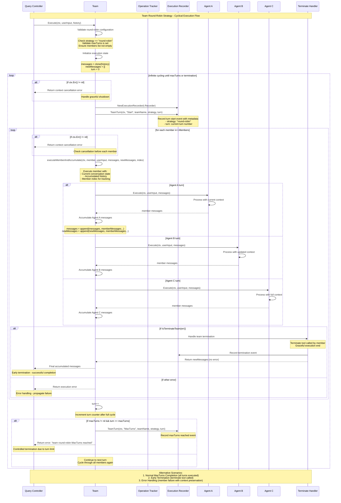

# Team Round Robin Strategy - Sequence Diagram

Code Version: v0.1.31  
Last updated on September 4, 2025

This document explains the sequence diagram for **Team Round Robin Strategy** in ARK, showing how team members are executed in continuous cycles with turn-based control, context accumulation, and graceful termination handling.

## System Overview

### Key Participants

1. **Query Controller** - Core ARK controller managing query lifecycle and team execution
2. **Team** - Team entity implementing round-robin execution strategy
3. **Operation Tracker** - Tracking and observability for team operations
4. **Execution Recorder** - Recording team turns, events, and execution metadata
5. **Agent A, B, C** - Team member agents executing in cyclical order
6. **Terminate Handler** - Graceful termination management for early exit scenarios

### Round Robin Strategy Architecture

ARK's Round Robin Strategy provides:

#### Core Features
- **Continuous Cycling**: All team members execute in sequence repeatedly
- **Turn-based Control**: Each turn processes all members once in configured order
- **MaxTurns Protection**: Configurable limit prevents infinite execution loops
- **Context Accumulation**: Each member receives complete conversation history
- **Graceful Termination**: Support for early exit via terminate tool calls
- **Cancellation Support**: Respects context cancellation at multiple checkpoints
- **Event Tracking**: Comprehensive recording of turns, completions, and terminations

#### Execution Characteristics
- **Sequential Processing**: Members execute one after another within each turn
- **State Preservation**: Conversation context accumulates across all executions
- **Error Handling**: Individual member failures handled with proper error propagation
- **Resource Management**: Context checking prevents resource exhaustion

## Sequence Diagram



## Round Robin Strategy Flow Phases

### Phase 1: Team Configuration & Validation
- **Strategy Validation**: Verify team is configured with "round-robin" execution strategy
- **MaxTurns Verification**: Ensure maxTurns parameter is set to prevent infinite loops
- **Member List Check**: Validate that team has at least one member configured
- **State Initialization**: Initialize conversation history clone and tracking variables
- **Execution Preparation**: Set up initial state for cyclical member processing

### Phase 2: Round-Robin Execution Loop
- **Context Monitoring**: Continuous checking for context cancellation and timeout
- **Turn Initialization**: Create execution recorder for turn-level tracking and observability
- **Event Recording**: Log turn start events with strategy metadata and turn counter
- **Loop Management**: Manage infinite loop with proper exit conditions
- **Resource Protection**: Prevent resource exhaustion through controlled execution

### Phase 3: Sequential Member Execution Within Turn
- **Member Iteration**: Process each team member in configured sequence order
- **Context Accumulation**: Each member receives complete conversation history
- **Individual Execution**: Agent executes with current context and user input
- **Message Aggregation**: Accumulate responses from each member into conversation flow
- **Progress Tracking**: Track member index and execution status within turn

### Phase 4: Termination Check
- **Termination Detection**: Check for terminate tool calls from any team member
- **Graceful Exit**: Handle early termination with proper message preservation
- **Error Propagation**: Distinguish between termination and execution errors
- **Event Logging**: Record termination events for observability and debugging
- **State Cleanup**: Ensure proper cleanup when exiting execution loop

### Phase 5: Turn Completion & MaxTurns Check
- **Turn Counter Update**: Increment turn counter after completing full member cycle
- **Limit Enforcement**: Check maxTurns constraint to prevent infinite execution
- **Completion Recording**: Log turn completion events with final metadata
- **Controlled Exit**: Return appropriate error when maxTurns limit reached
- **Loop Continuation**: Continue to next turn if limits not reached

## Team Configuration and Deployment

### Round Robin Team CRD Configuration
```yaml
apiVersion: ark.mckinsey.com/v1alpha1
kind: Team
metadata:
  name: brainstorming-team
spec:
  strategy: round-robin
  maxTurns: 3
  members:
    - name: brainstormer-agent
    - name: critic-agent
    - name: coordinator-agent
  description: "Round-robin brainstorming team with 3-turn limit"
```

### Agent Configuration for Team Members
```yaml
# Brainstormer Agent
apiVersion: ark.mckinsey.com/v1alpha1
kind: Agent
metadata:
  name: brainstormer-agent
spec:
  model:
    name: gpt-4
    type: openai
  prompt: |
    You are a creative brainstormer. Generate innovative ideas and solutions.
    Build upon previous team member contributions.

---
# Critic Agent  
apiVersion: ark.mckinsey.com/v1alpha1
kind: Agent
metadata:
  name: critic-agent
spec:
  model:
    name: gpt-4
    type: openai
  prompt: |
    You are a constructive critic. Analyze ideas and provide improvement suggestions.
    Identify potential issues and propose refinements.

---
# Coordinator Agent
apiVersion: ark.mckinsey.com/v1alpha1
kind: Agent
metadata:
  name: coordinator-agent
spec:
  model:
    name: gpt-4
    type: openai
  tools:
    - name: terminate_team
      description: "Call this when the team has reached a good conclusion"
  prompt: |
    You are a team coordinator. Synthesize team discussions and decide when to conclude.
    Call terminate_team when you believe the team has reached a satisfactory outcome.
```

### Query Configuration with Round Robin Team
```yaml
apiVersion: ark.mckinsey.com/v1alpha1
kind: Query
metadata:
  name: brainstorming-session
spec:
  team:
    name: brainstorming-team
  input: "How can we improve our product's user experience?"
```

## Execution Scenarios and Examples

### Scenario 1: Normal MaxTurns Completion
```
Turn 0: Brainstormer → Critic → Coordinator (3 executions)
Turn 1: Brainstormer → Critic → Coordinator (3 executions)  
Turn 2: Brainstormer → Critic → Coordinator (3 executions)
Result: MaxTurns reached after 9 total member executions
```

### Scenario 2: Early Termination
```
Turn 0: Brainstormer → Critic → Coordinator calls terminate_team
Result: Early exit after 3 executions with preserved conversation
```

### Scenario 3: Error Handling
```
Turn 0: Brainstormer → Critic executes normally
Turn 0: Coordinator execution fails with error
Result: Error returned with accumulated messages from successful executions
```

## Turn-based Execution Control

### Turn Structure
- **Turn Definition**: One complete cycle through all team members
- **Sequential Processing**: Members execute in configured order within each turn
- **Context Preservation**: Each member receives full conversation history
- **State Accumulation**: Messages accumulate across all member executions

### MaxTurns Protection
- **Infinite Loop Prevention**: Mandatory maxTurns configuration prevents runaway execution
- **Resource Management**: Controls computational resource consumption
- **Predictable Execution**: Known upper bound on execution time and cost
- **Debugging Support**: Clear turn boundaries for execution analysis

### Context Management
- **History Cloning**: Initial conversation history is safely cloned
- **Message Accumulation**: New messages added to conversation progressively
- **State Isolation**: Each member execution is independent within turn context
- **Memory Efficiency**: Efficient message handling and state management

## Error Handling and Recovery

### Cancellation Support
- **Context Monitoring**: Continuous checking for context cancellation
- **Graceful Shutdown**: Proper cleanup when execution is cancelled
- **Resource Cleanup**: Ensures no resource leaks during cancellation
- **State Preservation**: Maintains conversation state during controlled shutdown

### Termination Handling
- **Tool-based Termination**: Members can call terminate_team tool for early exit
- **Message Preservation**: All accumulated messages preserved during termination
- **Event Recording**: Termination events logged for observability
- **Error Distinction**: Clear distinction between termination and execution errors

### Failure Recovery
- **Member Error Isolation**: Individual member failures don't affect completed work
- **Partial Success Handling**: Return accumulated messages even on partial failures
- **Error Propagation**: Proper error context and debugging information
- **State Consistency**: Maintain consistent conversation state during errors

## Performance Considerations

### Execution Efficiency
- **Sequential Processing**: Predictable execution order and timing
- **Context Reuse**: Efficient conversation context management
- **Resource Monitoring**: Track execution time and computational resources
- **Cancellation Responsiveness**: Quick response to cancellation requests

### Scalability
- **Turn Limits**: MaxTurns provides natural scalability boundaries
- **Member Scaling**: Support for teams with varying member counts
- **Context Management**: Efficient handling of growing conversation histories
- **Event Tracking**: Scalable observability and monitoring

### Optimization Strategies
- **Early Termination**: Support for early exit when objectives are met
- **Context Pruning**: Optional conversation history optimization
- **Parallel Compatibility**: Foundation for future parallel execution modes
- **Resource Budgeting**: Integration with cost and resource management systems

This comprehensive round-robin strategy provides ARK teams with predictable, controlled execution while maintaining full conversation context and supporting graceful termination scenarios.
