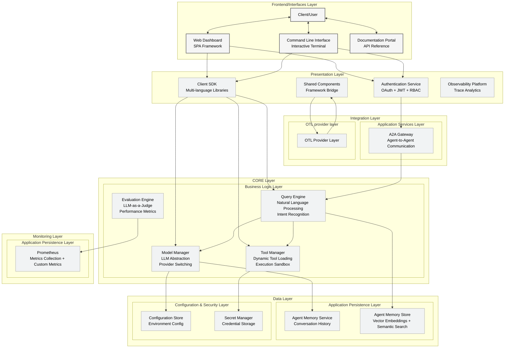

# ARK Platform - Logical Architecture

Code Version: v0.1.31  
Last updated on September 4, 2025

This document presents the comprehensive logical architecture of the ARK (Agents at Scale) platform, showing the layered structure and component interactions that enable scalable AI agent orchestration.

## Architecture Overview

The ARK platform is organized into distinct layers, each with specific responsibilities and clear separation of concerns. This architecture enables scalability, maintainability, and flexibility in AI agent deployment and management.

## Layer Descriptions

### 🖥️ Frontend/Interfaces Layer
- **Web Dashboard**: React-based SPA for visual agent management and monitoring
- **Command Line Interface**: Interactive terminal for developers and operators
- **Documentation Portal**: API reference and comprehensive guides

### 🔗 Presentation Layer
- **Authentication Service**: OAuth 2.0, JWT tokens, and RBAC authorization
- **Client SDK**: Multi-language libraries (Python, TypeScript, Go)
- **OTL Provider**: OpenTelemetry integration for distributed tracing
- **Observability Platform**: Real-time monitoring and analytics dashboard

### 🌐 Integration Layer
- **A2A Gateway**: Agent-to-Agent communication with message routing
- **MCP Integration**: Model Context Protocol for standardized tool access
- **External Execution Layer**: Langchain and custom execution engine support
- **API Gateway**: Centralized request routing and rate limiting

### 🧠 Core Layer - Business Logic

#### Query Engine
- **Natural Language Processing**: Intent recognition and query parsing
- **Context Management**: Maintains conversation context across interactions
- **Query Routing**: Directs queries to appropriate agents or teams

#### Team Orchestration Engine
- **Team Strategy Manager**: Round-robin, sequential, and custom strategies
- **Agent Assignment Logic**: Intelligent agent selection based on capabilities
- **Team Execution Coordinator**: Manages multi-agent workflows

#### Tool Manager
- **Dynamic Tool Loading**: Runtime tool discovery and registration
- **Execution Sandbox**: Secure tool execution environment
- **Tool Registry**: Centralized catalog of available tools and capabilities

#### Model Manager
- **LLM Abstraction**: Unified interface across different LLM providers
- **Provider Switching**: Dynamic model selection based on requirements
- **Load Balancing**: Distributes requests across available model instances

#### Event System
- **Operation Tracker**: Tracks all system operations with unique IDs
- **Event Recorder**: Kubernetes-native event logging
- **Event Analytics**: Real-time event analysis and alerting

#### Evaluation Engine
- **LLM-as-a-Judge**: Automated quality assessment of agent responses
- **Performance Metrics**: Response time, accuracy, and resource utilization
- **Continuous Improvement**: Feedback loops for model and agent optimization

### 💾 Data Layer - Application Persistence

#### Agent Memory Service
- **Conversation History**: Persistent storage of agent interactions
- **Context Management**: Long-term and short-term memory management
- **Semantic Search**: Vector-based retrieval of relevant context

#### Configuration Management
- **Environment Configuration**: Environment-specific settings and parameters
- **Secret Management**: Secure storage of API keys and credentials
- **Dynamic Configuration**: Runtime configuration updates without restarts

### 📊 Monitoring Layer

#### Prometheus Integration
- **Metrics Collection**: System and business metrics aggregation
- **Custom Metrics**: Agent-specific performance indicators
- **Alerting**: Threshold-based alerts and notifications

#### Langfuse Service
- **LLM Observability**: Token usage, latency, and cost tracking
- **Performance Analytics**: Model performance analysis and optimization
- **Usage Patterns**: Understanding of agent and model utilization

#### Distributed Tracing
- **Request Correlation**: End-to-end request tracing across services
- **Performance Profiling**: Bottleneck identification and optimization
- **Error Tracking**: Comprehensive error logging and analysis

## Key Architectural Principles

### 🔄 **Scalability**
- **Horizontal Scaling**: All components designed for horizontal scaling
- **Load Distribution**: Intelligent load balancing across instances
- **Resource Optimization**: Efficient resource utilization and auto-scaling

### 🛡️ **Security**
- **Zero Trust Architecture**: Authentication and authorization at every layer
- **Secret Management**: Centralized and encrypted credential storage
- **Network Isolation**: Secure communication between components

### 🔍 **Observability**
- **Comprehensive Monitoring**: Full-stack observability from infrastructure to business logic
- **Distributed Tracing**: End-to-end request tracking and performance analysis
- **Event-Driven Analytics**: Real-time insights into system behavior

### 🔧 **Maintainability**
- **Clean Separation**: Clear boundaries between layers and components
- **API-First Design**: Well-defined interfaces for all interactions
- **Configuration Management**: Externalized configuration for flexibility

### 🚀 **Extensibility**
- **Plugin Architecture**: Support for custom tools and execution engines
- **Provider Abstraction**: Easy integration of new LLM providers
- **Open Standards**: Support for industry standards like MCP and OpenTelemetry

## Component Interactions

### Request Flow
1. **User Request** → Frontend Layer → Authentication
2. **Authenticated Request** → API Gateway → Core Logic
3. **Business Processing** → Query Engine → Team Orchestration
4. **Agent Execution** → Tool Manager → External Tools
5. **Response Processing** → Event Recording → User Response

### Data Flow
1. **Configuration Data** → Configuration Store → Core Components
2. **Memory Data** → Agent Memory Service → Vector Store
3. **Metrics Data** → Prometheus → Observability Platform
4. **Event Data** → Event System → Monitoring Layer

### Monitoring Flow
1. **System Metrics** → Prometheus → Alerting
2. **LLM Metrics** → Langfuse → Analytics
3. **Trace Data** → OpenTelemetry → Distributed Tracing
4. **Events** → Event Recorder → Real-time Monitoring

This architecture provides a robust, scalable, and maintainable foundation for the ARK platform, enabling efficient management and orchestration of AI agents at scale while maintaining high observability and security standards.
