# Basic Query Execution in ARK Sequence Diagram

Code Version: v0.1.31  
Last updated on September 4, 2025

This document explains the complete execution flow of a Query in the ARK system, from query creation to final response delivery.

## Introduction

ARK (Agentic Runtime for Kubernetes) is a platform that enables running AI agents at scale on Kubernetes clusters. The central component for interacting with these agents is the **Query**, which represents a user request that can be directed to individual agents, agent teams, AI models, or specific tools.

## System Actors

### Primary Actors

1. ** User**: The person or system that creates and sends queries to the ARK system
2. ** QueryController**: Kubernetes controller that orchestrates all query execution
3. ** Agent**: Individual AI entity with a specific prompt, associated model, and available tools
4. ** Team**: Group of agents that collaborate using execution strategies (sequential, parallel, round-robin, etc.)
5. ** Model**: Language model (OpenAI, Azure, Bedrock, Gemini) that generates responses
6. ** Tool**: External tools that agents can use (HTTP APIs, MCP servers, built-in functions)
7. ** Memory**: Conversation storage system to maintain context between queries
8. ** ServiceAccount**: Service account for access control and RBAC isolation

### Supporting Actors

- **📊 TokenCollector**: Collector of model token usage metrics
- **📝 EventRecorder**: Event recorder for observability and auditing
- **🎯 ExecutionEngine**: Custom execution engine (optional, for specific implementations)

## System Inputs

### Query Resource (Primary Input)
```yaml
apiVersion: ark.mckinsey.com/v1alpha1
kind: Query
metadata:
  name: sample-query
  namespace: default
spec:
  # User input
  input: "What's the weather in Madrid today?"
  
  # Query targets (can be multiple)
  targets:
    - type: agent          # Types: agent, team, model, tool
      name: weather-agent
  
  # Dynamic parameters (optional)
  parameters:
    - name: location
      value: "Madrid"
    - name: language
      value: "English"
  
  # Memory reference for context (optional)
  memory:
    name: user-conversation
    namespace: default
  
  # Session ID for conversations (optional)
  sessionId: "user-123-session"
  
  # Service account for RBAC (optional)
  serviceAccount: weather-service-account
  
  # Execution timeout (optional)
  timeout: 300s
  
  # TTL for auto-cleanup (optional)
  ttl: 1h
```

### Template Parameters
Parameters enable dynamic queries using templates:
```yaml
# Templates can be used in input
input: "What's the weather in {{location}} in {{language}}?"
parameters:
  - name: location
    value: "Madrid"
  - name: language
    value: "English"
```

## System Outputs

### Successful Response
```yaml
status:
  # Query state
  phase: Completed
  
  # Final response message
  message: "The weather in Madrid today is sunny with temperature of 22°C..."
  
  # Responses per target (if multiple targets)
  responses:
    - target:
        type: agent
        name: weather-agent
      message: "The weather in Madrid today is sunny..."
      status: Success
  
  # Token usage metrics
  tokenUsage:
    promptTokens: 150
    completionTokens: 75
    totalTokens: 225
  
  # Execution timestamps
  startTime: "2025-09-03T10:00:00Z"
  completionTime: "2025-09-03T10:00:15Z"
```

### Error Response
```yaml
status:
  phase: Failed
  message: "Error: Could not connect to weather service"
  error: "Tool execution failed: HTTP 500 from weather API"
  responses:
    - target:
        type: agent
        name: weather-agent
      status: Failed
      error: "Tool call failed"
```

## Detailed Sequence Diagram

The following sequence diagram illustrates the complete flow of query execution in ARK, from initial user request through final response delivery:

```mermaid
sequenceDiagram
    participant U as 👤 User
    participant K as 🎛️ Kubernetes API
    participant QC as 🎮 QueryController
    participant SA as 🔐 ServiceAccount
    participant M as 💾 Memory
    participant A as 🤖 Agent
    participant T as 👥 Team
    participant AI as 🧠 Model
    participant TO as 🔧 Tool
    participant TC as 📊 TokenCollector
    participant ER as 📝 EventRecorder

    Note over U,ER: Phase 1: Query Creation
    U->>K: kubectl apply -f query.yaml
    K->>QC: Query resource created (watch event)
    QC->>ER: Emit "QueryReceived" event
    
    Note over QC,SA: Phase 2: Initialization and Validation
    QC->>QC: Validate TTL and expiry
    QC->>SA: Create impersonated client (RBAC)
    QC->>QC: Parse and validate targets
    QC->>TC: Initialize token collector
    QC->>ER: Emit "QueryStarted" event

    Note over QC,M: Phase 3: Context Preparation
    alt Memory reference provided
        QC->>M: Load conversation history
        M-->>QC: Historical messages[]
    else No memory
        QC->>QC: Initialize empty context
    end
    
    QC->>QC: Resolve template parameters in input
    QC->>ER: Emit "ContextLoaded" event

    Note over QC,TO: Phase 4: Execution by Target Type
    
    loop For each target in query.spec.targets
        alt Target type: "agent"
            QC->>A: Get Agent resource from K8s
            QC->>A: MakeAgent(context, client, agentCRD)
            A->>AI: Load and validate model config
            A->>TO: Register available tools
            A->>ER: Emit "AgentExecutionStarted"
            
            A->>AI: Execute(userInput, history)
            AI->>AI: Generate response with tools available
            
            opt Tool calls required
                AI->>TO: Execute tool calls
                TO->>TO: HTTP/MCP/Built-in tool execution
                TO-->>AI: Tool results
                AI->>AI: Generate final response with tool results
            end
            
            AI-->>A: Response messages[]
            A->>TC: Record token usage
            A->>ER: Emit "AgentExecutionCompleted"
            A-->>QC: Agent response messages

        else Target type: "team"
            QC->>T: Get Team resource from K8s
            QC->>T: MakeTeam(context, client, teamCRD)
            T->>ER: Emit "TeamExecutionStarted"
            
            alt Strategy: sequential
                T->>T: Execute members in order
                loop For each team member
                    T->>A: Execute member agent
                    A->>AI: Process with previous context
                    AI-->>A: Member response
                    A-->>T: Add to conversation history
                end
            else Strategy: parallel
                par For each member
                    T->>A: Execute member agent concurrently
                    A->>AI: Process independently
                    AI-->>A: Member response
                end
                T->>T: Aggregate all responses
            else Strategy: round-robin
                T->>T: Execute members in turns up to maxTurns
            else Strategy: selector
                T->>AI: AI selects next member dynamically
            end
            
            T->>TC: Record cumulative token usage
            T->>ER: Emit "TeamExecutionCompleted"
            T-->>QC: Team response messages

        else Target type: "model"
            QC->>AI: Get Model resource from K8s
            QC->>AI: Execute direct model call
            AI->>AI: Generate response without agent context
            AI->>TC: Record token usage
            AI-->>QC: Model response messages

        else Target type: "tool"
            QC->>TO: Get Tool resource from K8s
            QC->>TO: Create tool executor
            TO->>TO: Execute tool with resolved input
            TO-->>QC: Tool response messages
        end
    end

    Note over QC,K: Phase 5: Finalization and Persistence
    QC->>M: Save new messages to memory
    QC->>TC: Finalize token usage metrics
    QC->>QC: Aggregate all target responses
    QC->>K: Update Query status with results
    QC->>ER: Emit "QueryCompleted" event
    
    Note over U,K: Phase 6: Response to User
    K-->>U: Query status updated (watch event)
    U->>K: kubectl get query sample-query -o yaml
    K-->>U: Final response with results
```



253 | ## Flow Breakdown

*Figure 1: Complete sequence diagram showing the six phases of query execution in ARK. The diagram illustrates the interactions between all system components including the QueryController, Agents, Teams, Models, Tools, Memory, and supporting services.*

## Detailed Execution Flows

### 1. Template Resolution
Before execution, the system resolves any templates in the input:
```yaml
# Original input
input: "What's the weather in {{location}}?"
parameters:
  - name: location
    value: "Madrid"

# Resolved input
resolvedInput: "What's the weather in Madrid?"
```

### 2. Team Strategies

#### Sequential
```
Input → Agent1 → Agent2 → Agent3 → Output
```
Each agent receives the previous agent's output as context.

#### Parallel
```
Input → Agent1 ↘
      → Agent2 → Aggregate → Output
      → Agent3 ↗
```
All agents process the input simultaneously.

#### Round-Robin
```
Turn 1: Agent1 → Turn 2: Agent2 → Turn 3: Agent1 → ...
```
Agents take turns until reaching `maxTurns`.

#### Selector
```
Input → AI Selector → Chosen Agent → Output
```
An AI model dynamically chooses which agent should respond.

### 3. Tool Execution

Tools can be of three types:

#### Built-in Tools
Functions integrated into the system (e.g., calculator, text formatting).

#### HTTP Tools
```yaml
apiVersion: ark.mckinsey.com/v1alpha1
kind: Tool
spec:
  type: http
  http:
    url: "https://api.weather.com/v1/current"
    method: GET
    headers:
      Authorization: "Bearer {{api_key}}"
```

#### MCP Tools (Model Context Protocol)
```yaml
apiVersion: ark.mckinsey.com/v1alpha1
kind: Tool
spec:
  type: mcp
  mcpServer:
    name: filesystem-server
  function: "read_file"
```

## Error Handling

### Common Error Types

1. **Validation Errors**: Malformed query or non-existent targets
2. **Authentication Errors**: ServiceAccount without permissions
3. **Model Errors**: Model unavailable or quota exceeded
4. **Tool Errors**: External tool not responding
5. **Timeout Errors**: Execution exceeds time limit
6. **Memory Errors**: Cannot load/save context

### Recovery Strategies

- **Retry Logic**: Automatic retries for transient errors
- **Fallback Models**: Alternative models if primary fails
- **Graceful Degradation**: Continue without tools if they fail
- **Circuit Breaker**: Stop execution if many components fail

## Observability and Monitoring

### Kubernetes Events
The system emits detailed events at each phase:
```bash
kubectl get events --field-selector involvedObject.name=sample-query
```

### Token Usage Metrics
```yaml
tokenUsage:
  promptTokens: 150      # Tokens from input and context
  completionTokens: 75   # Tokens from generated response
  totalTokens: 225       # Total used
  modelCalls: 3          # Number of model calls
  toolCalls: 1           # Number of tool calls
```

### Traceability
Each execution generates distributed traces that enable:
- Following the complete flow of a query
- Identifying bottlenecks
- Analyzing usage patterns
- Detecting errors and failures

## Common Use Cases

### 1. Simple Agent Query
```yaml
spec:
  input: "Explain what photosynthesis is"
  targets:
    - type: agent
      name: biology-tutor
```

### 2. Sequential Team Analysis
```yaml
spec:
  input: "Analyze Q3 sales and propose improvements"
  targets:
    - type: team
      name: sales-analysis-team  # researcher → analyst → presenter
```

### 3. Model Comparison
```yaml
spec:
  input: "What is the capital of France?"
  targets:
    - type: model
      name: gpt-4
    - type: model
      name: claude-3
    - type: model
      name: gemini-pro
```

### 4. Direct Tool Execution
```yaml
spec:
  input: '{"city": "Madrid", "country": "Spain"}'
  targets:
    - type: tool
      name: weather-api
```

This diagram and documentation provide a complete understanding of the ARK system for developers who need to understand, maintain, or extend query execution functionality.
Version: v0.1.31
