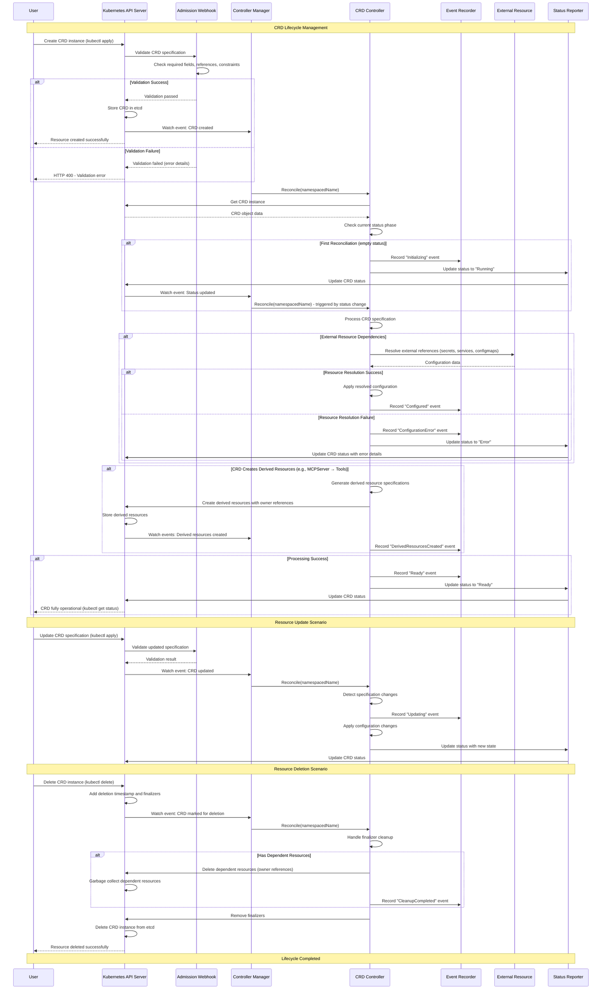

# CRD Lifecycle Management - Sequence Diagram

This document explains the sequence diagram for **CRD Lifecycle Management** in ARK, showing how Custom Resource Definitions are managed through their complete lifecycle from creation to deletion. ARK uses the Kubernetes controller pattern to manage various CRDs including Agents, Teams, Models, Tools, MCPServers, Memory, and Queries.

## System Overview

### Key Participants

1. **User** - Creates, updates, or deletes CRD instances
2. **Kubernetes API Server** - Validates and stores CRD instances
3. **Controller Manager** - ARK's controller manager process
4. **CRD Controller** - Specific controller for each CRD type (Agent, Query, Model, etc.)
5. **Admission Webhooks** - Validate CRD specifications before storage
6. **EventRecorder** - Records events for observability and debugging
7. **External Resources** - Services, secrets, configmaps that CRDs depend on
8. **Status Reporter** - Updates CRD status with current state

### CRD Types in ARK

The system manages several CRD types, each with their own controller:

1. **Agent** - AI agents with prompts, models, and tools
2. **Team** - Groups of agents with coordination strategies  
3. **Model** - Language model configurations
4. **Tool** - Individual tools and functions
5. **MCPServer** - Model Context Protocol servers for tool discovery
6. **Memory** - Conversation storage systems
7. **Query** - User requests to agents/teams
8. **Evaluator** - Evaluation configurations

### Lifecycle Phases

Each CRD follows a standard lifecycle with status phases:
- **Pending** - Initial state, not yet processed
- **Running** - Controller is processing the resource
- **Ready** - Resource is fully configured and operational
- **Error** - Configuration or processing errors occurred

## Sequence Diagram



## Lifecycle Management Phases

### Phase 1: Resource Creation and Validation
- **User action**: Creates a new CRD instance using `kubectl apply` or API calls
- **Admission validation**: Webhooks validate the specification against ARK's business rules
- **Storage**: Valid resources are stored in etcd via the Kubernetes API Server
- **Watch trigger**: Controller Manager detects the new resource and triggers reconciliation

### Phase 2: Controller Reconciliation Initialization
- **Reconcile trigger**: The appropriate CRD controller receives a reconciliation request
- **Resource fetch**: Controller retrieves the current state of the CRD from Kubernetes API
- **State assessment**: Controller examines the current status phase to determine required actions

### Phase 3: Status Initialization and State Machine
- **Initial state**: New resources start without status information
- **Status initialization**: Controller sets initial status phase (typically "Running")  
- **State machine**: Each controller implements a status-based state machine for processing

### Phase 4: Resource Processing and Configuration
- **Specification processing**: Controller processes the CRD's desired configuration
- **External dependencies**: Resolves references to secrets, configmaps, services, or other resources
- **Configuration application**: Applies the resolved configuration to make the resource operational
- **Error handling**: Failed configurations result in "Error" status with detailed error messages

### Phase 5: Derived Resource Management
- **Resource generation**: Some CRDs create child resources (e.g., MCPServer creates Tool resources)
- **Owner references**: Child resources are linked to parent via Kubernetes owner references
- **Cascade deletion**: When parent is deleted, Kubernetes automatically garbage collects children
- **Event recording**: All derived resource creation activities are recorded for observability

### Phase 6: Ready State and Operation
- **Operational state**: Successfully configured resources transition to "Ready" status
- **Continuous monitoring**: Controllers continue to watch for changes and maintain desired state
- **Status reporting**: Current state is continuously reported through Kubernetes status fields

### Phase 7: Update and Change Management
- **Change detection**: Controllers detect when CRD specifications are modified
- **Incremental updates**: Only changed aspects are reconfigured, minimizing disruption
- **Status transitions**: Resources may temporarily return to "Running" during updates
- **Change validation**: Updates go through the same admission webhook validation process

### Phase 8: Deletion and Cleanup
- **Deletion marker**: Kubernetes adds deletion timestamp when user requests deletion
- **Finalizer processing**: Controllers handle cleanup through finalizers before actual deletion
- **Dependent cleanup**: All dependent resources are cleaned up through owner references
- **Final removal**: Resources are removed from etcd after all cleanup is completed

## Controller Implementation Patterns

### Standard Controller Structure
```go
type ResourceReconciler struct {
    client.Client
    Scheme   *runtime.Scheme
    Recorder record.EventRecorder
}

func (r *ResourceReconciler) Reconcile(ctx context.Context, req ctrl.Request) (ctrl.Result, error) {
    // 1. Fetch resource
    // 2. Handle deletion (finalizers)
    // 3. Process based on status phase
    // 4. Update status
    return ctrl.Result{}, nil
}
```

### Status Phase State Machine
ARK controllers follow a consistent status phase pattern:
- **""** (empty) → **"Running"**: Initial state transition
- **"Running"** → **"Ready"**: Successful configuration completion
- **"Running"** → **"Error"**: Configuration failures
- **"Ready"** → **"Running"**: Triggered by specification changes
- **"Error"** → **"Running"**: Retry after error resolution

### Event Recording and Observability
- **Event types**: Normal events for successful operations, Warning events for errors
- **Event reasons**: Structured reason codes like "Configured", "Ready", "ValidationFailed"
- **Event messages**: Human-readable descriptions of what occurred
- **Metrics integration**: Controllers emit metrics for monitoring and alerting

## Error Handling and Recovery

### Validation Errors
- **Admission webhook rejection**: Invalid specifications are rejected before storage
- **Field validation**: Required fields, format validation, and business rule enforcement
- **Reference validation**: Ensures referenced resources exist and are accessible

### Runtime Errors
- **External resource failures**: Handling of missing secrets, services, or external dependencies
- **Network failures**: Retry logic for transient network issues
- **Resource conflicts**: Handling of resource creation conflicts and race conditions

### Recovery Mechanisms
- **Automatic retry**: Controllers automatically retry failed operations
- **Status reporting**: Clear error messages help users understand and fix issues
- **Event emission**: Detailed event history assists in troubleshooting

This comprehensive lifecycle management ensures reliable, observable, and maintainable operation of all ARK CRDs while following Kubernetes best practices and patterns.

Version: v0.1.31
