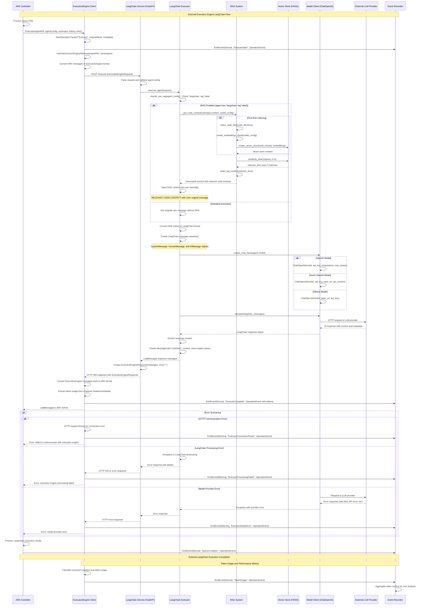

# External Execution Engine LangChain - Sequence Diagram

Code Version: v0.1.31  
Last updated on September 4, 2025

This document explains the sequence diagram for **External Execution Engine LangChain** integration in ARK, showing how queries are processed through the LangChain execution engine with support for RAG (Retrieval-Augmented Generation), model abstraction, and external service communication.

## System Overview

### Key Participants

1. **ARK Controller** - Core ARK controller managing query lifecycle
2. **ExecutionEngine Client** - ARK client for communicating with external execution engines
3. **LangChain Service** - External LangChain execution engine service (FastAPI)
4. **LangChain Executor** - Core LangChain executor handling agent execution
5. **RAG System** - Retrieval-Augmented Generation with vector search and embeddings
6. **Model Client** - LangChain model client (ChatOpenAI, Azure OpenAI, etc.)
7. **Vector Store (FAISS)** - Vector database for RAG code search
8. **External LLM Provider** - AI model provider (OpenAI, Azure OpenAI, Ollama)
9. **Event Recorder** - ARK event recording system for observability

### LangChain Integration Architecture

ARK's LangChain execution engine provides:

#### Core Features
- **External Service Integration**: HTTP-based communication with LangChain service
- **Model Abstraction**: Support for multiple LLM providers through unified interface
- **RAG Capabilities**: Optional retrieval-augmented generation with code indexing
- **Message Format Translation**: Conversion between ARK and LangChain message formats
- **Error Handling**: Comprehensive error tracking and recovery
- **Observability**: Full event recording and token usage tracking

#### Supported Model Types
1. **OpenAI**: Native OpenAI API integration
2. **Azure OpenAI**: Azure-hosted OpenAI models
3. **Ollama**: Local model inference
4. **Bedrock**: AWS Bedrock models (planned)

#### RAG System Components
- **Code Indexing**: Automatic Python file indexing with text splitting
- **Vector Embeddings**: OpenAI embeddings for semantic search
- **FAISS Vector Store**: High-performance vector similarity search
- **Context Injection**: Relevant code context injection into prompts

### Service Communication Protocol

#### Request Flow
1. **Query Submission**: User submits query to ARK Controller
2. **Engine Resolution**: ARK resolves ExecutionEngine address and configuration
3. **HTTP Communication**: RESTful API calls to LangChain service
4. **Message Conversion**: Automatic conversion between ARK and LangChain formats
5. **Response Processing**: LangChain responses converted back to ARK format

#### Data Formats
- **ExecutionEngineRequest**: Standardized request format with agent config and messages
- **ExecutionEngineResponse**: Response format with processed messages and metadata
- **Event Recording**: Comprehensive operation tracking and token usage metrics

## Sequence Diagram


## External Execution Engine Flow Phases

### Phase 1: Query Initiation and Engine Resolution
- **Query processing**: ARK Controller processes Query CRD and identifies ExecutionEngine requirement
- **Client initialization**: ExecutionEngine client is created with operation tracking
- **Address resolution**: ExecutionEngine address is resolved from Kubernetes service or external URL
- **Message conversion**: ARK internal messages are converted to ExecutionEngine standard format
- **Event tracking**: Operation start event is recorded for observability

### Phase 2: HTTP Request to LangChain Service
- **REST API call**: HTTP POST request to `/execute` endpoint with ExecutionEngineRequest
- **Service routing**: FastAPI service routes request to LangChain executor
- **Request validation**: Agent configuration and message format validation
- **Service initialization**: LangChain executor prepares for agent execution
- **Error handling**: Connection and timeout error handling with retry logic

### Phase 3: RAG Decision and Context Retrieval
- **RAG detection**: Check for `langchain: rag` label in agent configuration
- **Code indexing**: One-time indexing of Python files using RecursiveCharacterTextSplitter
- **Embeddings creation**: OpenAI embeddings client for semantic similarity
- **Vector search**: FAISS vector store similarity search for relevant code sections
- **Context building**: Compilation of relevant code context for injection into prompt

### Phase 4: LangChain Message Preparation
- **Format conversion**: ARK messages converted to LangChain message objects
- **Message sequence**: SystemMessage for agent prompt, HumanMessage for user input, AIMessage for history
- **RAG injection**: If enabled, relevant code context is injected into user message
- **Prompt resolution**: Agent prompt template resolution with parameter substitution
- **History management**: Conversation history maintained in LangChain format

### Phase 5: Model Client Creation and LLM Invocation
- **Client creation**: LangChain ChatOpenAI client created based on model configuration
- **Provider routing**: Support for OpenAI, Azure OpenAI, Ollama, and other providers
- **Configuration mapping**: Model parameters (temperature, max_tokens, etc.) applied
- **Async invocation**: Asynchronous LLM call using `ainvoke()` method
- **Response handling**: LangChain response object processing and content extraction

### Phase 6: Response Processing and Message Creation
- **Content extraction**: Response content extracted from LangChain response object
- **Message formatting**: Response converted to ARK Message format with proper role and metadata
- **Error detection**: Empty or invalid responses detected and handled
- **Response validation**: Message content validation and sanitization
- **Metadata preservation**: Agent name and other metadata preserved in response

### Phase 7: HTTP Response and Format Conversion
- **Response formatting**: ExecutionEngineResponse created with messages and error status
- **HTTP response**: JSON response sent back to ExecutionEngine client
- **Format conversion**: ExecutionEngine messages converted back to ARK internal format
- **Token extraction**: Token usage metadata extracted from response headers or body
- **Event recording**: Completion event recorded with execution metrics

### Phase 8: Error Handling (Alternative Flows)
- **Connection errors**: HTTP timeout, connection refused, DNS resolution failures
- **Processing errors**: LangChain execution errors, model client errors, RAG failures
- **Provider errors**: LLM provider rate limits, API errors, authentication failures
- **Recovery strategies**: Retry logic, fallback mechanisms, graceful degradation
- **Error propagation**: Proper error messages returned to ARK Controller

### Phase 9: Operation Completion and Event Recording
- **Result processing**: ARK Controller processes LangChain execution results
- **Integration completion**: External execution engine results integrated into query lifecycle
- **Event finalization**: Final query completion events recorded
- **State management**: Query state updated with execution results
- **Response delivery**: Final response delivered to user or calling system

### Phase 10: Performance and Token Tracking
- **Duration calculation**: End-to-end execution time measurement
- **Token aggregation**: Prompt tokens, completion tokens, and total tokens tracked
- **Cost analysis**: Token usage metrics for cost optimization
- **Performance monitoring**: Response time and throughput metrics
- **Observability**: Comprehensive metrics for system health monitoring

## Service Configuration and Deployment

### ExecutionEngine CRD Configuration
```yaml
apiVersion: ark.mckinsey.com/v1prealpha1
kind: ExecutionEngine
metadata:
  name: langchain-engine
spec:
  type: "langchain"
  address:
    value: "http://executor-langchain:8000"
  description: "LangChain-based execution engine with RAG support"
```

### Agent Configuration with LangChain
```yaml
apiVersion: ark.mckinsey.com/v1alpha1
kind: Agent
metadata:
  name: langchain-agent
  labels:
    langchain: rag  # Enable RAG functionality
    langchain-embeddings-model: text-embedding-ada-002  # Optional: custom embeddings model
spec:
  executionEngine:
    name: langchain-engine
  model:
    name: gpt-4
    type: openai
    config:
      openai:
        apiKey: "${OPENAI_API_KEY}"
        temperature: "0.7"
        maxTokens: "1000"
  prompt: |
    You are an expert Python developer assistant with deep knowledge of the codebase.
    When RAG context is provided, use it to give accurate, specific answers about the code.
    Reference specific functions, classes, and modules when relevant.
```

### Service Deployment
```bash
# Build and deploy LangChain execution engine
make executor-langchain-build
make executor-langchain-install

# Development mode
make executor-langchain-dev
```

## Message Format Translation

### ARK to ExecutionEngine Format
```json
{
  "agent": {
    "name": "langchain-agent",
    "namespace": "default",
    "prompt": "You are a helpful assistant...",
    "model": {
      "name": "gpt-4",
      "type": "openai",
      "config": {"openai": {"apiKey": "...", "temperature": "0.7"}}
    },
    "labels": {"langchain": "rag"}
  },
  "userInput": {
    "role": "user",
    "content": "How does the LangChain executor work?",
    "name": ""
  },
  "history": [
    {"role": "assistant", "content": "Previous response...", "name": "langchain-agent"}
  ],
  "tools": []
}
```

### LangChain Internal Format
```python
[
    SystemMessage(content="You are a helpful assistant..."),
    HumanMessage(content="🔥 RELEVANT CODE CONTEXT:\n\n{rag_context}\n\nUser: How does the LangChain executor work?"),
    AIMessage(content="Previous response...")
]
```

### ExecutionEngine Response Format
```json
{
  "messages": [
    {
      "role": "assistant",
      "content": "The LangChain executor works by...",
      "name": "langchain-agent"
    }
  ],
  "error": ""
}
```

## RAG System Architecture

### Code Indexing Process
1. **File Discovery**: Recursively scan Python files in code directory
2. **Text Splitting**: Use RecursiveCharacterTextSplitter with 1000 char chunks
3. **Document Creation**: Create LangChain Document objects with metadata
4. **Embeddings Generation**: Generate OpenAI embeddings for each chunk
5. **Vector Store**: Store embeddings in FAISS vector database

### RAG Query Flow
1. **Query Embeddings**: Generate embeddings for user query
2. **Similarity Search**: Find top-k most relevant code sections
3. **Context Building**: Compile relevant code with metadata
4. **Prompt Injection**: Inject context into user message
5. **Enhanced Response**: LLM generates response with code context

### RAG Configuration
```python
# Enable RAG in agent labels
labels = {"langchain": "rag"}

# Optional: Custom embeddings model
labels = {
    "langchain": "rag",
    "langchain-embeddings-model": "text-embedding-ada-002"
}
```

## Error Handling and Recovery

### Connection Error Handling
- **Timeout Configuration**: Configurable HTTP timeouts for external service calls
- **Retry Logic**: Exponential backoff retry for transient failures
- **Circuit Breaker**: Circuit breaker pattern for service health protection
- **Fallback**: Graceful degradation to built-in ARK execution engine

### Processing Error Handling
- **Validation Errors**: Request format validation with detailed error messages
- **Model Errors**: LLM provider error handling and user-friendly messages
- **RAG Errors**: Fallback to non-RAG execution if vector search fails
- **Resource Errors**: Memory and disk usage monitoring with limits

### Observability and Monitoring
- **Event Recording**: Comprehensive event recording at all phases
- **Token Tracking**: Detailed token usage for cost monitoring
- **Performance Metrics**: Response time, throughput, and error rate tracking
- **Health Checks**: Service health endpoints and monitoring integration

## Performance Considerations

### Scalability
- **Horizontal Scaling**: Multiple LangChain service instances with load balancing
- **Resource Optimization**: Memory and CPU optimization for vector operations
- **Caching**: Response caching for improved performance
- **Async Processing**: Asynchronous request processing with FastAPI

### Cost Optimization
- **Token Monitoring**: Real-time token usage tracking and alerting
- **Model Selection**: Intelligent model routing based on query complexity
- **Cache Strategy**: Response caching to reduce LLM API calls
- **RAG Efficiency**: Optimized vector search to minimize context size

This comprehensive external execution engine integration provides ARK with powerful LangChain capabilities while maintaining full observability, error handling, and performance optimization.

Version: v0.1.31
