# MCPServer to Tools - Sequence Diagram

Code Version: v0.1.31  
Last updated on September 4, 2025

This document explains the sequence diagram for **MCPServer to Tools Integration** in ARK, showing how MCP servers are discovered, tools are dynamically created as CRDs, and execution flows through the Model Context Protocol.

## System Overview

### Key Participants

1. **MCP Server Controller** - Kubernetes controller managing MCPServer CRD lifecycle
2. **MCP Client** - Client library implementing Model Context Protocol communication
3. **External MCP Server** - Third-party MCP server exposing tools via protocol
4. **Tool Registry** - Central registry for tool definitions and executors
5. **Agent** - ARK agent utilizing tools discovered from MCP servers
6. **Kubernetes API** - K8s API for CRD management and resource operations

### MCPServer Integration Architecture

ARK's MCPServer to Tools system provides:

#### Core Features
- **Protocol Compliance**: Full Model Context Protocol v1.0 implementation
- **Dynamic Discovery**: Automatic detection and registration of MCP server tools
- **CRD Lifecycle Management**: Automated Tool CRD creation, updates, and cleanup
- **Connection Resilience**: Robust connection management with automatic reconnection
- **Schema Validation**: JSON Schema validation for tool inputs and outputs
- **Error Recovery**: Comprehensive error handling and graceful degradation
- **Ownership Management**: Proper Kubernetes controller references and garbage collection

#### MCP Integration Benefits
- **Ecosystem Interoperability**: Connect to any MCP-compliant server
- **Zero-Configuration Tools**: Tools automatically available without manual registration
- **Schema Enforcement**: Type-safe tool execution with validated inputs
- **Resource Management**: Kubernetes-native lifecycle management
- **Scalable Architecture**: Support for multiple MCP servers with connection pooling

## Sequence Diagram

```mermaid
sequenceDiagram
    participant Controller as MCP Server Controller
    participant MCPClient as MCP Client
    participant MCPServer as External MCP Server
    participant Registry as Tool Registry
    participant Agent as Agent
    participant K8s as Kubernetes API

    Note over Controller, K8s: MCPServer to Tools Discovery & Execution Flow

    %% Phase 1: MCPServer CRD Processing & Connection
    Controller->>Controller: Reconcile(ctx, req) - MCPServer CRD
    Note over Controller: State machine: Discovering → Ready/Error
    
    Controller->>Controller: processServer(ctx, mcpServer)
    Controller->>Controller: BuildMCPServerURL(ctx, k8sClient, mcpServerCRD)
    Note over Controller: Resolve ValueSource:<br/>- Direct value<br/>- ServiceRef<br/>- Secret reference
    
    alt ServiceRef resolution
        Controller->>K8s: Get Service for address resolution
        K8s-->>Controller: Service with IP/DNS + port
    else Secret reference
        Controller->>K8s: Get Secret for credentials
        K8s-->>Controller: Secret data for authentication
    end
    
    Controller->>MCPClient: NewMCPClient(baseURL)
    
    MCPClient->>MCPServer: Initialize connection
    Note over MCPServer: Model Context Protocol handshake<br/>Capabilities negotiation
    
    alt Connection successful
        MCPServer-->>MCPClient: Connection established
        Note over MCPClient: MCP protocol initialized
    else Connection failed
        MCPServer-->>MCPClient: Connection error
        MCPClient-->>Controller: Connection failure
        Controller->>Controller: setCondition(MCPServerReady, false)
        Note over Controller: Update status and requeue
    end

    %% Phase 2: Tool Discovery via MCP Protocol
    Controller->>MCPClient: ListTools(ctx)
    Note over MCPClient: MCP protocol: list_tools request
    
    MCPClient->>MCPServer: ListToolsRequest
    MCPServer->>MCPServer: Enumerate available tools
    Note over MCPServer: Server-specific tool catalog:<br/>- Function definitions<br/>- Input schemas<br/>- Descriptions
    
    MCPServer-->>MCPClient: ListToolsResponse
    Note over MCPClient: Array of mcp.Tool objects:<br/>- Name, description<br/>- InputSchema (JSON Schema)<br/>- Tool-specific metadata
    
    alt ListTools successful
        MCPClient-->>Controller: []mcp.Tool
        Note over Controller: Tool discovery complete
    else ListTools failed
        MCPClient-->>Controller: Error
        Controller->>Controller: setCondition(MCPServerReady, false)
        Note over Controller: Handle discovery failure
    end

    %% Phase 3: Tool CRD Creation & Management
    Controller->>Controller: createTools(ctx, mcpServer, mcpTools)
    
    Controller->>K8s: List existing Tool CRDs for MCPServer
    K8s-->>Controller: Existing Tool CRDs with labels
    
    loop For each mcp.Tool
        Controller->>Controller: generateToolName(mcpServerName, toolName)
        Note over Controller: Create unique tool name:<br/>"mcpserver-toolname" pattern
        
        Controller->>Controller: buildToolCRD(mcpServer, mcpTool, toolName)
        Note over Controller: Create Tool CRD with:<br/>- Type: "mcp"<br/>- InputSchema from MCP<br/>- MCPServerRef<br/>- Controller reference
        
        Controller->>K8s: Create or Update Tool CRD
        K8s-->>Controller: Tool CRD created/updated
        Note over Controller: Tool available in cluster
    end
    
    Controller->>Controller: Delete zombie tools
    Note over Controller: Remove tools no longer in MCP server
    
    Controller->>Controller: finalizeMCPServerProcessing(ctx, mcpServer, toolCount)
    Controller->>Controller: setCondition(MCPServerReady, true)

    %% Phase 4: Tool Registration in Agent Lifecycle
    Agent->>Agent: Initialize agent with tool refs
    Note over Agent: Agent CRD specifies tool names
    
    Agent->>K8s: Get Tool CRDs by name
    K8s-->>Agent: Tool CRD definitions
    
    Agent->>Registry: RegisterTool(def, MCPExecutor)
    Note over Registry: Create MCPExecutor with:<br/>- MCPClient reference<br/>- Tool name for MCP calls
    
    Registry->>Registry: Store tool definition and executor
    Note over Registry: Tool available for agent execution

    %% Phase 5: Tool Execution During Agent Processing
    Agent->>Agent: Process LLM response with tool calls
    Note over Agent: LLM requests tool execution
    
    Agent->>Registry: ExecuteTool(ctx, toolCall)
    
    Registry->>Registry: Find MCPExecutor for tool
    Registry->>MCPClient: Execute via MCPExecutor
    
    MCPClient->>MCPClient: Parse tool arguments
    Note over MCPClient: json.Unmarshal tool call arguments
    
    MCPClient->>MCPServer: CallTool(ctx, CallToolRequest)
    Note over MCPServer: MCP protocol: call_tool request<br/>with tool name and arguments
    
    MCPServer->>MCPServer: Execute tool logic
    Note over MCPServer: Server-specific tool implementation:<br/>- File operations<br/>- API calls<br/>- Database queries<br/>- External integrations
    
    MCPServer-->>MCPClient: CallToolResponse
    Note over MCPClient: Response content:<br/>- Text content<br/>- Error information<br/>- Structured data
    
    MCPClient->>MCPClient: Process response content
    Note over MCPClient: Convert MCP response to ToolResult:<br/>- Extract text content<br/>- Handle structured responses<br/>- Format for agent consumption
    
    MCPClient-->>Registry: ToolResult
    Registry-->>Agent: Tool execution result
    
    Agent->>Agent: Continue processing with tool result
    Note over Agent: Incorporate tool result into conversation

    %% Phase 6: Error Handling & Recovery
    alt MCP Server unavailable
        Controller->>MCPClient: Connection attempt
        MCPClient-->>Controller: Connection timeout/error
        Controller->>Controller: setCondition(MCPServerReady, false, "ServerUnavailable")
        Controller->>K8s: Delete all associated Tool CRDs
    else Tool execution fails
        MCPClient->>MCPServer: CallTool request
        MCPServer-->>MCPClient: Error response
        MCPClient-->>Registry: ToolResult with error
        Registry-->>Agent: Error result for handling
    else Tool discovery fails
        MCPClient->>MCPServer: ListTools request
        MCPServer-->>MCPClient: Error response
        Controller->>Controller: Keep existing tools, schedule retry
    end

    Note over Controller, K8s: Key Features:<br/>• MCP Protocol Compliance<br/>• Dynamic Tool Discovery<br/>• CRD Lifecycle Management<br/>• Connection Resilience<br/>• Schema Validation
```


## MCPServer Integration Flow Phases

### Phase 1: MCPServer CRD Processing & Connection
- **Controller Reconciliation**: Process MCPServer custom resource with state machine management
- **URL Resolution**: Support for direct values, ServiceRef, and Secret references
- **MCP Handshake**: Initialize Model Context Protocol connection with capabilities negotiation
- **Connection Validation**: Verify server availability and protocol compatibility
- **Status Management**: Update MCPServerReady condition based on connection state

### Phase 2: Tool Discovery via MCP Protocol
- **List Tools Request**: Use MCP `list_tools` protocol method to discover available tools
- **Tool Enumeration**: Server returns complete tool catalog with metadata
- **Schema Extraction**: Capture JSON Schema definitions for input validation
- **Capability Assessment**: Analyze tool descriptions and parameter requirements
- **Discovery Validation**: Handle partial failures and missing tool information

### Phase 3: Tool CRD Creation & Management
- **Tool Naming**: Generate unique tool names using "mcpserver-toolname" pattern
- **CRD Generation**: Create Tool custom resources with MCP-specific configuration
- **Schema Integration**: Embed JSON Schema from MCP server into Tool CRD
- **Reference Management**: Establish controller ownership for garbage collection
- **Lifecycle Synchronization**: Update, create, and cleanup tools based on server state

### Phase 4: Tool Registration in Agent Lifecycle
- **Agent Initialization**: Agent discovers tools through Kubernetes Tool CRDs
- **Executor Creation**: Register MCPExecutor with Tool Registry for each MCP tool
- **Client Binding**: Associate MCP client connections with specific tool executors
- **Registry Integration**: Make tools available for standard ARK tool execution flow
- **Type System Integration**: Ensure MCP tools work seamlessly with existing tool types

### Phase 5: Tool Execution During Agent Processing
- **LLM Integration**: Process tool calls from language model responses
- **Argument Parsing**: Convert tool call arguments to MCP-compatible format
- **Protocol Execution**: Execute `call_tool` MCP protocol request
- **Server Processing**: MCP server performs tool-specific logic and operations
- **Response Handling**: Convert MCP responses to ARK ToolResult format
- **Context Integration**: Incorporate tool results into agent conversation context

### Phase 6: Error Handling & Recovery
- **Connection Resilience**: Handle MCP server disconnections and timeouts
- **Protocol Errors**: Manage MCP protocol-level errors and version mismatches
- **Tool Failures**: Graceful handling of tool execution errors
- **Discovery Failures**: Retry mechanisms for temporary server issues
- **Cleanup Operations**: Remove orphaned Tool CRDs when servers become unavailable

## MCPServer Configuration

### MCPServer CRD Definition
```yaml
apiVersion: ark.mckinsey.com/v1alpha1
kind: MCPServer
metadata:
  name: filesystem-mcp
spec:
  transport: sse
  endpoint:
    serviceRef:
      name: mcp-filesystem-service
      port: 8080
      path: "/sse"
  headers:
    Authorization:
      secretRef:
        name: mcp-auth-secret
        key: token
  capabilities:
    tools: {}
    resources: {}
  reconnectPolicy:
    maxRetries: 5
    backoffInterval: "30s"
```

### Service Reference Configuration
```yaml
apiVersion: v1
kind: Service
metadata:
  name: mcp-filesystem-service
spec:
  selector:
    app: mcp-filesystem-server
  ports:
  - name: mcp-sse
    port: 8080
    targetPort: 8080
  type: ClusterIP

---
apiVersion: v1
kind: Secret
metadata:
  name: mcp-auth-secret
type: Opaque
data:
  token: <base64-encoded-auth-token>
```

### Auto-Generated Tool CRD
```yaml
# Generated automatically by MCPServer controller
apiVersion: ark.mckinsey.com/v1alpha1
kind: Tool
metadata:
  name: filesystem-mcp-read-file
  labels:
    ark.mckinsey.com/mcp-server: filesystem-mcp
  ownerReferences:
  - apiVersion: ark.mckinsey.com/v1alpha1
    kind: MCPServer
    name: filesystem-mcp
    uid: <server-uid>
    controller: true
spec:
  type: mcp
  description: "Read contents of a file"
  parameters:
    type: object
    properties:
      path:
        type: string
        description: "Path to the file to read"
    required: ["path"]
  mcp:
    server: filesystem-mcp
    tool: read_file
```

## Tool Discovery and Registration

### MCP Protocol Flow
```json
// ListTools Request (MCP Client → MCP Server)
{
  "jsonrpc": "2.0",
  "id": 1,
  "method": "tools/list",
  "params": {}
}

// ListTools Response (MCP Server → MCP Client)
{
  "jsonrpc": "2.0",
  "id": 1,
  "result": {
    "tools": [
      {
        "name": "read_file",
        "description": "Read contents of a file",
        "inputSchema": {
          "type": "object",
          "properties": {
            "path": {
              "type": "string",
              "description": "Path to the file to read"
            }
          },
          "required": ["path"]
        }
      }
    ]
  }
}
```

### Tool Execution Flow
```json
// CallTool Request (MCP Client → MCP Server)
{
  "jsonrpc": "2.0",
  "id": 2,
  "method": "tools/call",
  "params": {
    "name": "read_file",
    "arguments": {
      "path": "/etc/config.yaml"
    }
  }
}

// CallTool Response (MCP Server → MCP Client)
{
  "jsonrpc": "2.0",
  "id": 2,
  "result": {
    "content": [
      {
        "type": "text",
        "text": "# Configuration file\napi_key: secret123\ndebug: true"
      }
    ]
  }
}
```

## Agent Integration

### Agent CRD with MCP Tools
```yaml
apiVersion: ark.mckinsey.com/v1alpha1
kind: Agent
metadata:
  name: file-manager-agent
spec:
  model:
    name: gpt-4
    type: openai
  tools:
    - name: filesystem-mcp-read-file
    - name: filesystem-mcp-write-file
    - name: filesystem-mcp-list-directory
  prompt: |
    You are a file management assistant with access to filesystem operations.
    You can read, write, and list files and directories.
```

### Runtime Tool Execution
```go
// Agent processes LLM response with tool calls
toolCall := &ToolCall{
    ID:   "call_123",
    Type: "function",
    Function: &Function{
        Name: "filesystem-mcp-read-file",
        Arguments: `{"path": "/etc/config.yaml"}`,
    },
}

// Registry routes to MCPExecutor
result, err := registry.ExecuteTool(ctx, toolCall)

// Result contains file contents
fmt.Printf("File contents: %s", result.Content)
```

## Error Handling and Resilience

### Connection Management
```yaml
# MCPServer status reflects connection state
status:
  conditions:
  - type: MCPServerReady
    status: "True"
    lastTransitionTime: "2025-09-04T10:30:00Z"
    reason: "Connected"
    message: "Successfully connected to MCP server"
  - type: ToolsDiscovered
    status: "True"
    lastTransitionTime: "2025-09-04T10:30:15Z"
    reason: "DiscoveryComplete"
    message: "Discovered 5 tools from MCP server"
  connectedAt: "2025-09-04T10:30:00Z"
  lastDiscovery: "2025-09-04T10:30:15Z"
  toolCount: 5
```

### Error Scenarios and Recovery

#### Server Unavailable
```yaml
status:
  conditions:
  - type: MCPServerReady
    status: "False"
    lastTransitionTime: "2025-09-04T10:35:00Z"
    reason: "ConnectionTimeout"
    message: "Failed to connect to MCP server after 5 retries"
  nextRetry: "2025-09-04T10:36:00Z"
```

#### Tool Execution Errors
```go
// MCP server returns error for tool call
{
  "jsonrpc": "2.0",
  "id": 2,
  "error": {
    "code": -32000,
    "message": "File not found",
    "data": {
      "path": "/nonexistent/file.txt"
    }
  }
}

// Converted to ToolResult for agent
result := &ToolResult{
    ID:      "call_123",
    Name:    "filesystem-mcp-read-file",
    Content: "",
    Error:   "File not found: /nonexistent/file.txt",
}
```

## Performance and Scalability

### Connection Pooling
- **Persistent Connections**: Maintain long-lived MCP connections for efficiency
- **Connection Reuse**: Share connections across multiple tool executions
- **Load Balancing**: Distribute requests across multiple MCP server instances
- **Circuit Breaker**: Prevent cascade failures with automatic circuit breaking

### Monitoring and Observability
```go
// Metrics for MCP integration
mcpConnectionsTotal.WithLabelValues(serverName).Inc()
mcpToolDiscoveryDuration.WithLabelValues(serverName).Observe(duration.Seconds())
mcpToolExecutionCount.WithLabelValues(serverName, toolName, status).Inc()
mcpConnectionErrors.WithLabelValues(serverName, errorType).Inc()
```

### Resource Management
- **Memory Efficiency**: Efficient JSON parsing and response handling
- **Garbage Collection**: Automatic cleanup of disconnected server resources
- **Rate Limiting**: Configurable limits on tool execution frequency
- **Timeout Management**: Proper timeout handling for long-running operations

## MCP Ecosystem Integration

### Supported MCP Server Types
- **Filesystem Servers**: File operations, directory management
- **Database Servers**: SQL query execution, database operations
- **API Gateway Servers**: REST API proxying and transformation
- **Development Tools**: Code analysis, testing, deployment operations
- **Cloud Integration**: AWS, Azure, GCP service interactions

### Protocol Compliance
- **MCP v1.0 Support**: Full compliance with Model Context Protocol specification
- **Transport Layer**: Support for SSE (Server-Sent Events) and WebSocket transports
- **Capability Negotiation**: Dynamic capability discovery and validation
- **Version Compatibility**: Backward compatibility with MCP protocol versions

This comprehensive MCPServer to Tools integration enables ARK to dynamically discover and utilize any MCP-compliant server, providing seamless access to external tools and services through the standardized Model Context Protocol.
