# Tool Execution Flow - Sequence Diagram

Code Version: v0.1.31  
Last updated on September 4, 2025

This document explains the sequence diagram for **Tool Execution Flow** in ARK, showing how agents execute tools through various executors including HTTP APIs, Model Context Protocol (MCP) servers, Kubernetes resources, and built-in tools.

## System Overview

### Key Participants

1. **Agent** - ARK agent executing LLM responses with tool calls
2. **ToolRegistry** - Central registry managing tool definitions and executors
3. **ToolExecutor** - Base interface for tool execution implementations
4. **HTTPExecutor** - Executor for REST API tool calls
5. **MCPExecutor** - Executor for Model Context Protocol tools
6. **ExternalAPI** - External REST APIs (DuckDuckGo, weather services, etc.)
7. **MCPServer** - Model Context Protocol server implementations
8. **K8sClient** - Kubernetes client for resource operations
9. **EventRecorder** - Observability and telemetry recording

### Tool Execution Architecture

ARK's Tool Execution system provides:

#### Core Features
- **Multi-Protocol Support**: HTTP REST APIs, Model Context Protocol, Kubernetes resources
- **Unified Interface**: Single ToolRegistry manages all tool types transparently
- **Dynamic Resolution**: Runtime discovery and routing to appropriate executors
- **Error Handling**: Comprehensive error recovery and reporting mechanisms
- **Authentication**: Support for ConfigMaps, Secrets, and custom headers
- **Connection Pooling**: Efficient resource management for external connections
- **Event Tracking**: Complete observability for tool execution telemetry

#### Tool Types Supported
- **HTTP Tools**: RESTful API integrations with template parameter substitution
- **MCP Tools**: Model Context Protocol for structured agent-to-agent communication
- **Kubernetes Tools**: Native K8s resource operations with RBAC support
- **Built-in Tools**: Noop testing tools and conversation termination controls

## Sequence Diagram

```mermaid
sequenceDiagram
    participant Agent as Agent
    participant TR as ToolRegistry
    participant TE as ToolExecutor
    participant HTTP as HTTPExecutor
    participant MCP as MCPExecutor
    participant ExtAPI as External API
    participant MCPSrv as MCP Server
    participant K8s as K8s Client
    participant ER as Event Recorder

    Note over Agent, ER: Tool Execution Flow - Multi-Protocol Support

    %% Phase 1: Tool Call Initiation
    Agent->>Agent: LLM returns tool calls in response
    Note over Agent: ChatCompletion response contains tool_calls[]
    
    Agent->>Agent: executeToolCalls(ctx, toolCalls, agentMessages, newMessages)
    
    loop For each tool call
        Agent->>Agent: executeToolCall(ctx, toolCall)
        
        Agent->>TR: ExecuteTool(ctx, toolCall)
        Note over TR: Registry manages tool definitions and executors
        
        TR->>TR: Find executor by tool name
        Note over TR: Look up in executors map[string]ToolExecutor
        
        alt Tool not found
            TR-->>Agent: ToolResult{Error: "tool not found"}
            Note over TR: Return error immediately
        end
        
        TR->>TE: Execute(ctx, toolCall)
        Note over TE: Delegate to specific executor implementation

        %% Phase 2: Tool Type Resolution & Execution
        alt HTTP Tool
            TR->>HTTP: Execute(ctx, toolCall)
            Note over HTTP: HTTPExecutor handles RESTful API calls
            
            HTTP->>K8s: Get Tool CRD
            K8s-->>HTTP: Tool specification with HTTP config
            
            HTTP->>HTTP: Resolve URL template with parameters
            Note over HTTP: Template substitution from toolCall.Function.Arguments
            
            HTTP->>HTTP: Resolve headers from ConfigMaps/Secrets
            Note over HTTP: Support for authentication headers
            
            HTTP->>HTTP: Build HTTP request (GET/POST/PUT/DELETE)
            Note over HTTP: Method, body, headers configuration
            
            HTTP->>ExtAPI: HTTP Request
            Note over ExtAPI: External REST API (DuckDuckGo, weather, etc.)
            
            ExtAPI-->>HTTP: HTTP Response
            
            HTTP->>HTTP: Process response (status, body parsing)
            Note over HTTP: Handle success/error responses
            
            HTTP-->>TR: ToolResult{Content: response_body}
            
        else MCP Tool
            TR->>MCP: Execute(ctx, toolCall)
            Note over MCP: MCPExecutor handles Model Context Protocol
            
            MCP->>K8s: Get Tool CRD
            K8s-->>MCP: Tool specification with MCP config
            
            MCP->>K8s: Get MCPServer CRD
            K8s-->>MCP: MCPServer configuration (URL, headers, transport)
            
            MCP->>MCP: BuildMCPServerURL(ctx, k8sClient, mcpServerCRD)
            Note over MCP: Resolve service/ingress address
            
            MCP->>MCP: Resolve headers from ConfigMaps/Secrets
            Note over MCP: Authentication and custom headers
            
            MCP->>MCP: Create/reuse MCP client connection
            Note over MCP: Connection pooling for efficiency
            
            MCP->>MCPSrv: MCP Protocol Request
            Note over MCPSrv: Model Context Protocol communication
            
            MCPSrv->>MCPSrv: Process tool request
            Note over MCPSrv: Tool-specific logic execution
            
            MCPSrv-->>MCP: MCP Protocol Response
            
            MCP->>MCP: Parse MCP response format
            Note over MCP: Extract content and handle errors
            
            MCP-->>TR: ToolResult{Content: mcp_response}
            
        else Kubernetes Tool
            TR->>TE: Execute(ctx, toolCall)
            Note over TE: Native Kubernetes resource operations
            
            TE->>K8s: Kubernetes API operations
            Note over K8s: kubectl-like functionality
            
            K8s-->>TE: Kubernetes resource response
            
            TE-->>TR: ToolResult{Content: k8s_response}
            
        else Built-in Tool
            alt Noop Tool
                TR->>TR: NoopExecutor.Execute()
                Note over TR: Testing/placeholder tool<br/>Return success message
                
            else Terminate Tool
                TR->>TR: TerminateExecutor.Execute()
                Note over TR: Conversation termination signal<br/>Return termination message
            end
            
            TR-->>Agent: ToolResult{Content: builtin_response}
        end

        %% Phase 3: Tool Result Processing
        TR-->>Agent: ToolResult{ID, Name, Content, Error}
        
        Agent->>Agent: Create tool message from result
        Note over Agent: Convert ToolResult to Message format
        
        Agent->>Agent: Add tool message to conversation
        Note over Agent: Append to agentMessages and newMessages
        
        Agent->>ER: Emit tool execution event
        ER->>ER: Record tool execution telemetry
        
        alt Tool execution error
            Agent->>Agent: Include error in tool message
            Note over Agent: Error handling continues conversation
        end
    end

    Agent->>Agent: Continue LLM loop with tool results
    Note over Agent: Next LLM call includes tool responses

    %% Alternative Error Scenarios
    Note over Agent, MCPSrv: Error Handling Scenarios:<br/>• HTTP API failures (404, 500, timeout)<br/>• Authentication failures<br/>• MCP server connectivity issues<br/>• Kubernetes RBAC permission failures<br/>• Tool definition validation errors
```



## Tool Execution Flow Phases

### Phase 1: Tool Call Initiation
- **LLM Response Processing**: Agent receives ChatCompletion response containing tool_calls array
- **Batch Execution**: Execute multiple tool calls from single LLM response sequentially
- **Context Management**: Maintain conversation context throughout tool execution chain
- **Registry Lookup**: Delegate to ToolRegistry for tool discovery and executor routing
- **Error Handling**: Handle tool-not-found scenarios with graceful error responses

### Phase 2: Tool Type Resolution & Execution

#### HTTP Tool Execution
- **CRD Resolution**: Retrieve Tool custom resource definition from Kubernetes
- **Template Processing**: Substitute URL templates with parameters from tool call arguments
- **Authentication Setup**: Resolve headers from ConfigMaps and Secrets for API authentication
- **Request Construction**: Build HTTP request with method, body, headers, and query parameters
- **External API Communication**: Execute HTTP request against external REST APIs
- **Response Processing**: Parse response body and handle HTTP status codes appropriately

#### MCP Tool Execution
- **Dual CRD Resolution**: Retrieve both Tool and MCPServer custom resource definitions
- **Service Discovery**: Build MCP server URL from Kubernetes service/ingress configuration
- **Connection Management**: Create or reuse MCP client connections with connection pooling
- **Protocol Communication**: Execute Model Context Protocol request/response cycle
- **Response Parsing**: Extract content from MCP response format and handle protocol errors

#### Kubernetes Tool Execution
- **Native Operations**: Direct Kubernetes API operations with kubectl-like functionality
- **RBAC Integration**: Respect Kubernetes role-based access control permissions
- **Resource Management**: Handle creation, reading, updating, and deletion of K8s resources
- **API Response Handling**: Process Kubernetes API responses and error conditions

#### Built-in Tool Execution
- **Noop Tools**: Testing and placeholder tools for development and debugging
- **Terminate Tools**: Conversation termination signals for agent control flow
- **Immediate Response**: Built-in tools execute locally without external communication

### Phase 3: Tool Result Processing
- **Result Standardization**: Convert all executor responses to standardized ToolResult format
- **Message Creation**: Transform ToolResult into conversation message format
- **Context Accumulation**: Add tool messages to ongoing conversation history
- **Telemetry Recording**: Emit tool execution events for observability and monitoring
- **Error Propagation**: Include error information in tool messages for LLM context
- **Continuation Preparation**: Prepare conversation state for next LLM interaction

## Tool Registry Management

### Tool Registration Process
```go
// Tool registration with executor binding
registry.RegisterTool(toolDefinition, executor)

// Schema generation for LLM consumption
tools := registry.GetToolDefinitions()
openAITools := registry.ToOpenAITools()

// Runtime tool categorization
toolType := registry.GetToolType(toolName)
```

### Tool Definition Structure
```yaml
apiVersion: ark.mckinsey.com/v1alpha1
kind: Tool
metadata:
  name: web-search
spec:
  type: http
  description: "Search the web using DuckDuckGo API"
  parameters:
    type: object
    properties:
      query:
        type: string
        description: "Search query"
    required: ["query"]
  http:
    url: "https://api.duckduckgo.com/?q={{.query}}&format=json"
    method: GET
    headers:
      User-Agent: "ARK-Agent/1.0"
```

### MCP Tool Configuration
```yaml
apiVersion: ark.mckinsey.com/v1alpha1
kind: Tool
metadata:
  name: filesystem-read
spec:
  type: mcp
  description: "Read file contents via MCP filesystem server"
  parameters:
    type: object
    properties:
      path:
        type: string
        description: "File path to read"
    required: ["path"]
  mcp:
    server: filesystem-mcp-server
    tool: read_file

---
apiVersion: ark.mckinsey.com/v1alpha1
kind: MCPServer
metadata:
  name: filesystem-mcp-server
spec:
  transport: sse
  endpoint: http://mcp-filesystem:8080/sse
  headers:
    Authorization: "Bearer {{.SECRET_TOKEN}}"
```

## Tool Execution Scenarios

### Scenario 1: HTTP API Tool Call
```
1. Agent receives tool call: web_search(query="ARK platform")
2. ToolRegistry routes to HTTPExecutor
3. HTTPExecutor resolves Tool CRD configuration
4. URL template substitution: https://api.duckduckgo.com/?q=ARK%20platform&format=json
5. HTTP GET request to DuckDuckGo API
6. Parse JSON response and return search results
7. Agent adds tool response to conversation context
```

### Scenario 2: MCP Tool Call
```
1. Agent receives tool call: read_file(path="/etc/config.yaml")
2. ToolRegistry routes to MCPExecutor
3. MCPExecutor resolves Tool and MCPServer CRDs
4. MCP client connects to filesystem server
5. MCP protocol request: {"method": "read_file", "params": {"path": "/etc/config.yaml"}}
6. MCP server processes file read operation
7. Agent receives file contents in tool response
```

### Scenario 3: Error Handling
```
1. Agent calls non-existent tool: invalid_tool()
2. ToolRegistry lookup fails
3. Return ToolResult{Error: "tool not found"}
4. Agent includes error in conversation context
5. LLM receives error message and can adjust strategy
```

## Authentication and Security

### Header Resolution
- **ConfigMap Integration**: Resolve headers from Kubernetes ConfigMaps
- **Secret Management**: Secure authentication token resolution from Secrets
- **Template Substitution**: Dynamic header value resolution with template variables
- **Multi-Protocol Support**: Consistent authentication across HTTP and MCP protocols

### RBAC Integration
```yaml
apiVersion: rbac.authorization.k8s.io/v1
kind: ClusterRole
metadata:
  name: ark-tool-executor
rules:
- apiGroups: ["ark.mckinsey.com"]
  resources: ["tools", "mcpservers"]
  verbs: ["get", "list"]
- apiGroups: [""]
  resources: ["configmaps", "secrets"]
  verbs: ["get"]
```

### Security Considerations
- **Least Privilege**: Tools execute with minimal required permissions
- **Secret Isolation**: Authentication secrets isolated per tool/server
- **Network Policies**: Control tool access to external APIs and MCP servers
- **Audit Logging**: Complete audit trail of tool executions and authentication events

## Performance Considerations

### Connection Management
- **HTTP Connection Pooling**: Reuse HTTP connections for improved performance
- **MCP Connection Reuse**: Persistent MCP client connections across tool calls
- **Timeout Configuration**: Configurable timeouts for external API calls
- **Circuit Breaker**: Fault tolerance for failing external services

### Scalability
- **Concurrent Execution**: Support for parallel tool execution within agent contexts
- **Resource Limits**: Configurable limits on tool execution resources
- **Cache Integration**: Optional caching for frequently accessed tool results
- **Load Balancing**: Distribution of MCP server connections across multiple instances

### Monitoring and Observability
```go
// Tool execution metrics
toolExecutionCount.WithLabelValues(toolName, executorType).Inc()
toolExecutionDuration.WithLabelValues(toolName).Observe(duration.Seconds())
toolExecutionErrors.WithLabelValues(toolName, errorType).Inc()

// Event recording for observability
recorder.Event(agent, corev1.EventTypeNormal, "ToolExecution", 
    fmt.Sprintf("Executed tool %s successfully", toolName))
```

## Error Handling and Recovery

### HTTP Error Scenarios
- **Network Failures**: Connection timeouts, DNS resolution failures
- **HTTP Status Errors**: 4xx client errors, 5xx server errors
- **Authentication Failures**: Invalid API keys, expired tokens
- **Response Parsing**: Invalid JSON, unexpected response format
- **Rate Limiting**: API quota exceeded, backoff and retry logic

### MCP Error Scenarios
- **Server Connectivity**: MCP server unavailable, connection refused
- **Protocol Errors**: Version mismatches, invalid message format
- **Tool Availability**: Tool not found on MCP server, capability mismatches
- **Transport Issues**: SSE connection drops, WebSocket failures
- **Authentication**: MCP server authentication failures

### Kubernetes Error Scenarios
- **API Server Errors**: Kubernetes API unavailable, authentication failures
- **RBAC Permissions**: Insufficient permissions for resource operations
- **Resource Validation**: Invalid resource definitions, schema validation failures
- **Network Policies**: Blocked communications, service discovery failures

### Recovery Strategies
- **Graceful Degradation**: Continue conversation with error context
- **Retry Logic**: Configurable retry with exponential backoff
- **Fallback Tools**: Alternative tool implementations for critical functionality
- **Error Context**: Rich error information for LLM decision making

This comprehensive tool execution system enables ARK agents to interact with diverse external systems while maintaining security, observability, and reliability across all tool types.

Version: v0.1.31